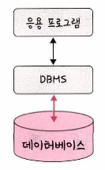
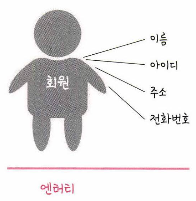
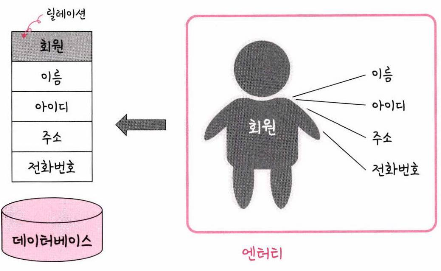
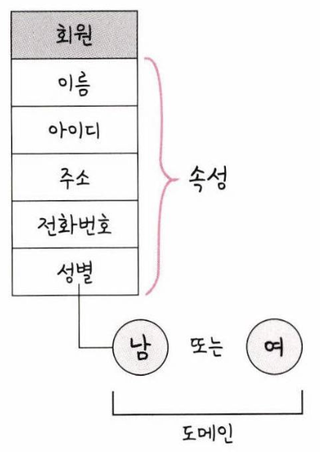

# 엔티티

## 전체 구조

- **응용 프로그램**: Spring, Node.js, PHP 등의 프로그램
- **DBMS**: 데이터베이스를 제어, 관리하는 통합 시스템

](./images/dbms.png)

출처: [https://hongong.hanbit.co.kr/데이터베이스-이해하기-databasedb-dbms-sql의-개념/](https://hongong.hanbit.co.kr/%EB%8D%B0%EC%9D%B4%ED%84%B0%EB%B2%A0%EC%9D%B4%EC%8A%A4-%EC%9D%B4%ED%95%B4%ED%95%98%EA%B8%B0-databasedb-dbms-sql%EC%9D%98-%EA%B0%9C%EB%85%90/)

- **데이터베이스**: 일정한 규칙, 혹은 규약을 통해 구조화되어 저장되는 데이터의 모음

## Flow

### 1. 쿼리 실행 (Query Execution)

1.  **쿼리 전송 (Query Transmission)**

- 응용 프로그램은 사용자의 요청에 따라 SQL 쿼리를 작성
- 작성된 쿼리는 DBMS로 전송됩니다. 이때, [JDBC](https://ittrue.tistory.com/250), ODBC, ADO.NET 등의 API를 사용
- 쿼리는 일반적으로 문자열 형태로 전송되며, 네트워크를 통해 DBMS에 도달

2. **쿼리 파싱 및 최적화 (Query Parsing and Optimization)**

- DBMS는 받은 쿼리를 파싱합니다. 파싱 과정에서 쿼리의 문법을 확인하고, 의미를 분석
- 파싱된 쿼리는 DBMS 내부에서 최적화됩니다. 최적화는 쿼리를 가장 효율적으로 실행할 수 있는 방법을 찾는 과정
- 최적화된 쿼리는 [실행 계획(Execution Plan)](https://kukim.tistory.com/128)으로 변환

3. **쿼리 실행 (Query Execution)**

- DBMS는 실행 계획에 따라 쿼리를 실행
- 실행 과정에서 DBMS는 DB에 접근하여 필요한 데이터를 읽거나 작성
- 데이터는 DB의 물리적 저장소(디스크 또는 메모리)에서 읽혀짐

4. **결과 반환 (Result Return)**

- 쿼리 실행이 완료되면, DBMS는 결과 데이터를 응용 프로그램에게 반환합니다.
- 결과 데이터는 일반적으로 테이블 형태로 구성되며, 네트워크를 통해 응용 프로그램에게 전달됩니다.
- 응용 프로그램은 받은 결과 데이터를 사용자에게 표시하거나, 추가 로직을 수행합니다.

### **2. 데이터 조작 (Data Manipulation)**

- 데이터 삽입/수정/삭제
- 응용 프로그램은 사용자의 입력이나 다른 데이터 소스로부터 새로운 데이터를 받음
- 받은 데이터는 SQL의 INSERT 문을 사용하여 DB에 삽입
- DBMS는 INSERT/UPDATE/DELETE 문을 실행하고, 새로운 데이터를 DB에 저장

---

## 엔티티

사람, 장소, 물건, 사진, 개념 등 여러 개의 속성을 지닌 명사

## 릴레이션

데이터베이스에서 정보를 구분하여 저장하는 기본 단위

- RDB에서는 **테이블**, NoSQL DB에서는 **컬렉션** 이라고 부름
- MySQL(RDB)의 구조는 **레코드 < 테이블 < 데이터베이스**로 구성
- MongoDB(NoSQL DB)의 구조는 **도큐먼트 < 컬렉션 < 데이터베이스**로 구성

## 속성

릴레이션에서 관리하는 구체적이며 고유한 이름을 갖는 정보

## 도메인

릴레이션에 포함된 각각의 속성들이 가질 수 있는 값의 집합
