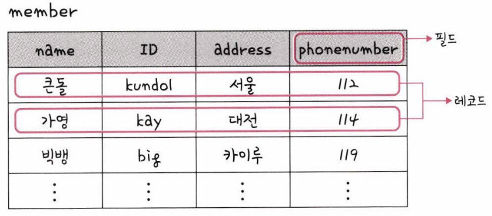
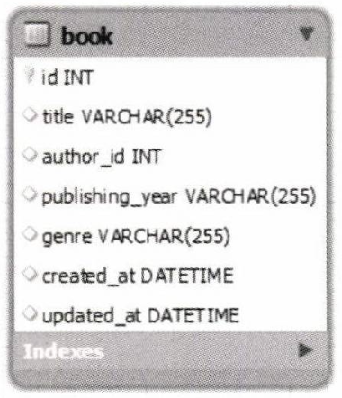
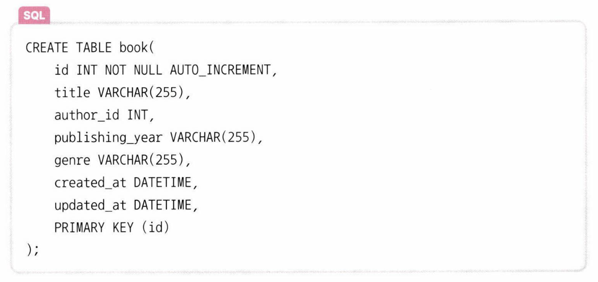
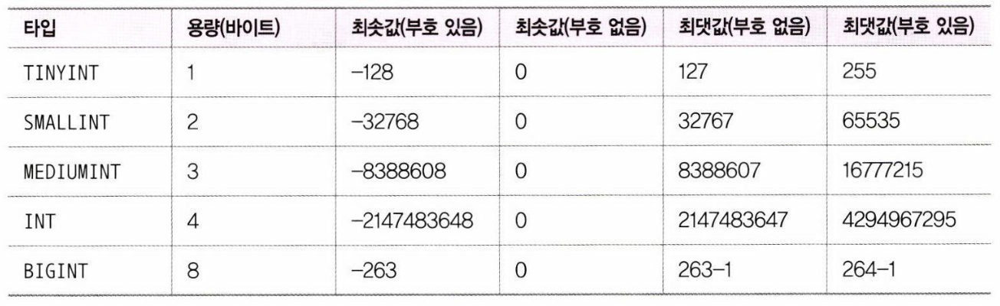

# 필드와 레코드

### 예시 테이블

예시 book 테이블 생성 DDL Query

## 필드 타입

### 숫자 타입

### 날짜 타입

- **DATE**: 날짜 부분은 있지만 시간 부분은 없는 타입 / 3Byte / 예시) 2023-05-20
- **DATETIME**: 날짜 및 시간 부분을 모두 포함하는 타입 / 8Byte / 예시) 2023-05-20 14:30:00
- **TIMESTAMP**: 날짜 및 시간 부분을 모두 포함하는 타입 / 4 ~ ?Byte / 예시) 2023-05-20 14:30:00+09:00 \*[TIMESTAMP와 DATETIME의 차이](https://fascinate-zsoo.tistory.com/38)

### 문자 타입

- **CHAR**: 선언할 길이로 고정되며 0 ~ 255 Byte의 값을 지정할 수 있는 타입
- **VARCHAR**: 가변 길이 문자열로, 0 ~ 65,535 Byte 사이의 값으로 지정할 수 있는 타입
- **TEXT**: 큰 문자열 저장에 쓰며 주로 게시판의 본문을 저장할때 사용하는 타입 (65,535)
- **BLOB**: 이미지, 동영상 등 큰 데이터 저장에 사용
- **ENUM**: 문자열 열거 타입으로, 열거되지 않은 값이 들어올 경우 빈 문자열로 저장 (최대 65,535개의 요소 저장 가능)
- **SET**: ENUM과 비슷하지만 여러 개의 데이터를 선택할 수 있고, 비트 단위의 연산을 할 수 있음(최대 64개의 요소 저장)
