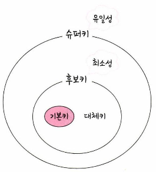
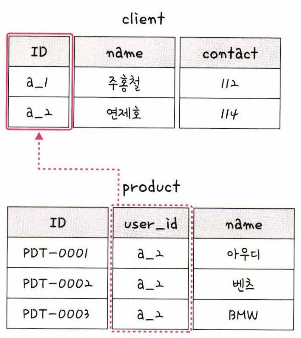

# 키

### 유일성(uniqueness)

릴레이션에 있는 모든 튜플에 대해 유일하게 식별되는 것을 의미

### 최소성(minimality)

유일성을 가진 키를 구성하는 속성(Attribute) 중 하나라도 제외하는 경우 유일성이 깨지는 것을 의미

## 기본키

PK라고 하며, 유일성과 최소성을 만족하는 키

### 자연키

중복된 값들을 제외하며 중복되지 않는 것을 자연스레 뽑다가 나오는 키

### 인조키

인위적으로 유저 ID를 부여하는 키를 의미하며 MySQL의 auto increment 값이 대표적인 예시

\*보통 기본키를 인조키로 설정

## 외래키

FK라고 하며, 다른 테이블의 기본키를 그대로 참조하는 키

## 후보키

기본키가 될 수 있는 후보들이며 유일성과 최소성을 동시에 만족하는 키

## 대체키

후보키가 두 개 이상일 경우 어느 하나를 기본키로 지정하고 남은 후보키들

## 슈퍼키

각 레코드를 유일하게 식별할 수 있는 유일성을 갖춘 키
