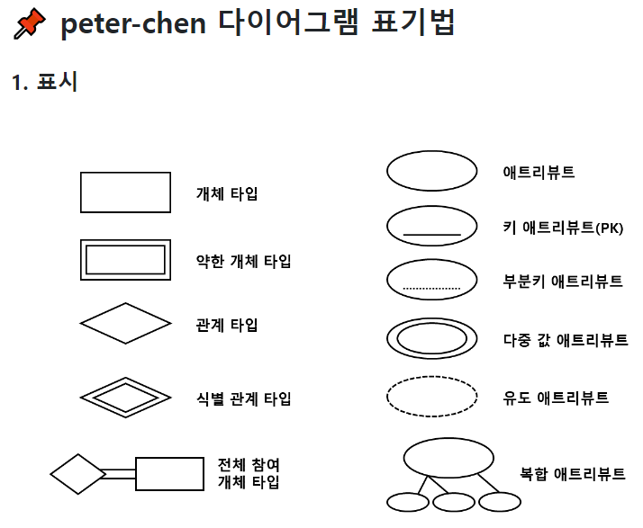
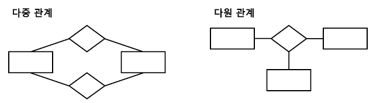
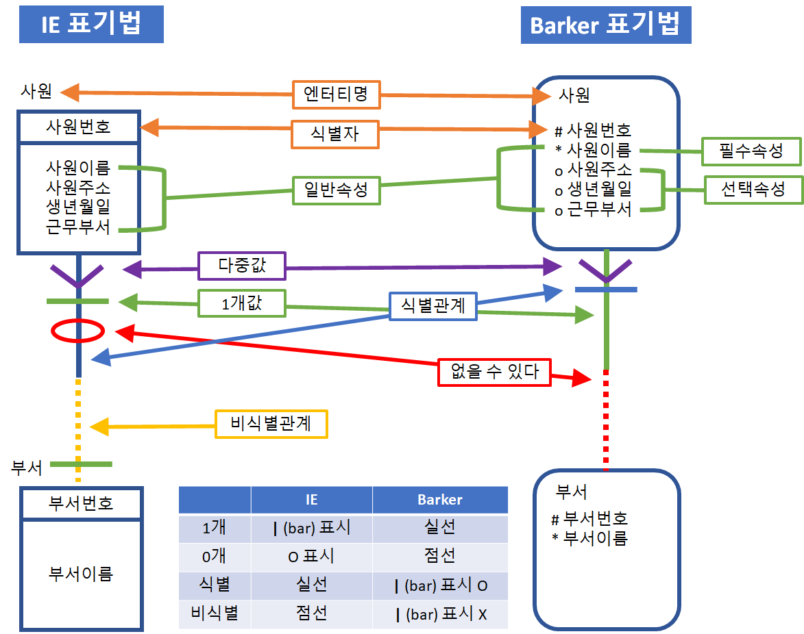
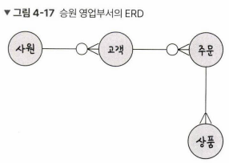
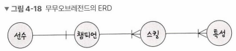

# ERD의 중요성
- ERD(Entity Relationship Diagram): 데이터베이스를 구축할 때 가장 기초적인 뼈대 역할을 하며, 릴레이션 간의 관계들을 정의
- ERD는 시스템의 요구 사항을 기반으로 작성되며 ERD를 기반으로 데이터베이스를 구축
- ERD는 관계형 구조로 표현할 수 있는 데이터를 구성하는 데 유용할 수 있지만 비정형 데이터를 충분히 표현할 수 없다는 단점 존재

## peter-chen 표기법 & IE 표기법 & Barker 표기법

## ERD 예제
- 승원 영업부서의 ERD
- 요구 사항
  - 영업사원은 0~n명의 고객을 관리한다.
  - 고객은 0~n개의 주문을 넣을 수 있다.
  - 주문에는 1~n개의 상품이 들어간다.
- 정답

- 무무오브레전드의 ERD
- 요구 사항
  - 선수들은 1명의 챔피언을 고를 수 있다.
  - 챔피언은 한 개 이상의 스킬을 갖는다.
  - 스킬은 한 개 이상의 특성을 갖는다.
- 정답

[참고 자료]
- erd 표기법: https://velog.io/@yooonji08/%EB%8D%B0%EC%9D%B4%ED%84%B0%EB%B2%A0%EC%9D%B4%EC%8A%A4-ER%EB%8B%A4%EC%9D%B4%EC%96%B4%EA%B7%B8%EB%9E%A8%EC%9D%84-IE%ED%91%9C%EA%B8%B0%EB%B2%95%EC%9C%BC%EB%A1%9C-%EB%B0%94%EA%BE%B8%EA%B8%B0
- IE 표기법 vs Barker 표기법: https://lotuus.tistory.com/43