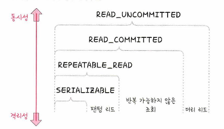

# 트랜잭션과 무결성

- 데이터 베이스에서 하나의 논리적 기능을 수행하기 위한 작업의 단위를 말함  
- 여러개의 쿼리 실행을 하나의 작업으로 묶는다.  
- 이에 대한 특징은 원자성, 일관성, 독립성, 지속성이 있다.  

## 원자성(atomicity)
- 하나의 작업은 모두 수행되거나 수행되지 않아야 한다.
- 하나의 작업은 더이상 쪼개질 수 없다.
- 즉 하나의 작업이 쪼개질 경우 문제가 생긴다

### 하나의 작업?
예를들어 홍철이가 규영이에게 500원을 보낸다고 가정하자  
돈을 보내려면 우선 홍철이의 계좌에 500원 이상이 있는지 검사하고, 홍철이의 계좌에서 500원을 차감하고, 규영이 계좌에 500원을 추가해야 한다.  
즉 위 3개의 플로우를 하나의 **작업** 으로 보는 것이다.  

### rollback
홍철이가 규영이에게 돈을 보내는 **작업**을 하는데 중간에 에러가 발생한다면 이전 실행은 모두 취소되어야 한다.  
왜냐하면 원자성은 all or nothing 이기 때문이다.  
그래서 이전 실행을 취소하는 작업을 rollback 이라고 한다.  
- 홍철이 계좌에 돈이 충분히 있는지 조회
- 홍철이 계좌에서 500원을 차감
- 규영이 계좌로 500원 추가 -> 이때 에러 발생 
- rollback 수행
- 홍철이 계좌에 500원이 차감된것을 취소

### commit
작업이 모두 성공적으로 실행되었다면 데이터베이스에 반영(영구 저장)한다.  
이것을 커밋이라고 한다.

## 일관성 (consistency)
일관성이란 허용된 방식으로만 데이터를 변경해야 하는 것을 의미한다.  
예를들어 홍철이가 100만원이 있고 범석이는 0원이 있다고 가정한다면  
범석이가 홍철이에게 50만원을 입금할 순 없을것이다.  
이러한 특성 때문에 일관성을 유지해야하는 책임은 애플리케이션에 넘긴다고 한다.  

## 격리성 (isolate)
트랜잭션 수행 시 서로 끼어들지 못하는 것을 말한다.  
각 트랜잭션은 독립적으로 동작해야 한다.  

  

SERIALIZABLE, REPEATABLE_READ, READ_COMMITED, READ_UNCOMMITED  
따라서 데이터 베이스는 4개의 격리수준으로 구분해 놓았고 위로 갈 수록 동시성은 좋아지지만 격리성은 약해진다.  

### 격리 수준에서 발생하는 현상
이러한 특성 떄문에 각 격리 수준에서 나타나는 현상들이 있다.  
- REPEATABLE_READ: 팬텀 리드  
- READ_COMMITED: 팬텀 리드, 반복 가능하지 않은 조회  
- READ_UNCOMMITED: 팬텀 리드, 반복 가능하지 않은 조회, 더티 리드  

#### 팬텀 리드
한 트랜잭션에서 동일한 쿼리를 보냈을 때 해당 조회 결과가 다른 경우를 말한다.  
예를들어 두번째 쿼리시 없던 row가 생기거나 있던 row가 없어지는 현상  

- 트랜잭션 A: "나이 30 이상인 모든 고객"을 조회함.
- 트랜잭션 B: 나이 30인 새로운 고객을 추가함.
- 트랜잭션 A: "나이 30 이상인 모든 고객"을 다시 조회할 때, 새로운 고객이 추가된 것을 확인함.

#### 반복 가능하지 않은 조회
반복 가능하지 않은 조회는 하나의 트랜잭션이 같은 쿼리를 두 번 수행할 때 그 사이에  
다른 트랜잭션이 해당 데이터를 변경하여 서로 다른 결과를 얻는 상황이다.  
주로 읽은 데이터를 다른 트랜잭션이 수정 또는 삭제하는 경우 발생한다.
- 트랜잭션 A: 특정 고객의 잔액을 조회함.
- 트랜잭션 B: 같은 고객의 잔액을 수정함.
- 트랜잭션 A: 다시 고객의 잔액을 조회할 때, 처음과 다른 값을 얻게 됨.  

#### 더티 리드
더티 리드는 하나의 트랜잭션이 커밋되지 않은 다른 트랜잭션의 변경 사항을 읽는 상황을 말한다.  
이는 아직 확정되지 않은 데이터를 읽는 것이므로 해당 트랜잭션이 롤백되면 일관성이 깨지게 된다.  

- 트랜잭션 A: 특정 고객의 잔액을 $100에서 $200으로 변경하지만 커밋하지 않음.
- 트랜잭션 B: 동일한 고객의 잔액을 읽음. 이 때, 잔액이 $200으로 나타남.
- 트랜잭션 A: 롤백을 수행하여 잔액이 다시 $100으로 복구됨.
- 트랜잭션 B는 이미 잘못된 데이터를 읽었음.

### 격리수준
#### SERIALIZABLE
- 트랜잭션을 순차적으로 진행한다.  
- 여러 트랜잭션이 동시에 같은 행에 접근할 수 없다.  
- 가장 엄격한 수준으로 격리한다.  

#### REPEATABLE_READ
- 하나의 트랜잭션이 수행한 행을 다른 트랜잭션이 수정할 수 없도록 막아주지만 새로운 행을 추가하는 것은 막지 않는다.
- 이러한 특성덕에 팬텀 리드가 발생

#### READ_COMMITED
- 가장 많이 사용되는 격리 수준
- 커밋이 완료된 데이터에 대해서만 조회를 허용한다.  
- 하지만 하나의 트랜잭션이 접근한 행을 다른 트랜잭션이 수정할 수도 있음.  
- 이러한 특성 덕에 반복 가능하지 않은 조회 문제 발생

#### READ_UNCOMMITED
- 커밋되지 않은 데이터도 읽을 수 있다.  
- 데이터 무결성이 중요하다면 되도록이면 사용하지 않는 것이 좋다.  
- 하지만 몇몇 행이 제대로 조회되지 않더라도 괜찮은 거대한 양의 데이터를 어림잡아 집계하는 데는 사용하면 좋음  

## 지속성
성공적으로 수행된 트랜잭션은 영원히 반영되어야 한다.  
데이터베이스 시스템에 장애가 발생해도 원래 상태로 복구하는 회복 기능이 있어야 함을 뜻하며  
데이터베이스는 이를 위해 체크섬, 저널링, 롤백 등의 기능을 제공한다.  

### 체크섬
- 중복 검사의 한 형태, 오류 정정을 통해 송신된 자료의 무결성을 보호하는 단순한 방법
### 저널링
- 파일 시스템 또는 데이터베이스 시스템에 변경 사항을 반영 하기전에 로깅하는 것, 트랜잭션 등 변경사항에 대한 로그를 남기는 것  

