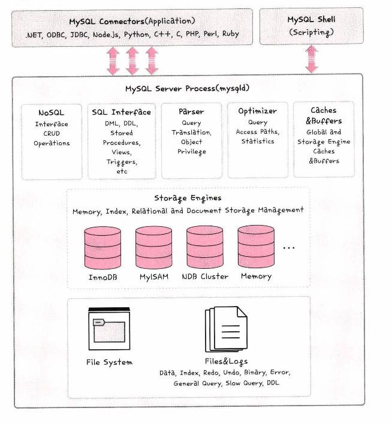

# 데이터베이스의 종류

## RDBMS 
- 행과 열을 가지는 표 형식 데이터를 저장하는 형태의 데이터베이스이다.  
- SQL을 사용한다.  
- MySQL, PostgreSQL, 오라클, MSSQL 등이 있다.  

### MySQL
- C, C++ 기반
- B-Tree, R-Tree 기반의 인덱스, 스레드 기반의 메모리 할당 시스템, 매우 빠른 조인, 최대 64개의 인덱스,  
- 가장 많은 서비스에서 사용중인 엔진  

  
