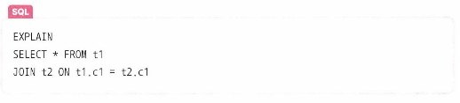

## 인덱스 최적화 기법

### 1.인덱스는 비용이다

인덱스는 두번 탐색하도록 강요함, 인덱스 리스트, 컬렉션 순으로 탐색하기 때문에 읽기 비용이 발생  
-> 필요한 컬럼에만 인덱스를 생성하는 것이 중요

### 2. 항상 테스팅하라

서비스 특징에 따라 달라지므로, 서비에스 사용하는 객체의 깊이, 테이블의 양에 따라 인덱스를 설정

- explain 문을 통해 서비스에서 사용하는 쿼리를 분석하고 그에따른 인덱스를 생성해야 함
  

### 3. 복합 인덱스는 같음, 정렬, 다중 값, 카디널리티 순이다

- 일반적으로 여러 필드를 기반으로 조회를 할 때 복합 인덱스를 생성하는데, 이 인덱스를 생성할 때는
  순서가 있고 생성 순서에 따라 인덱스 성능이 달라짐
  1. == 조건
  2. ASC, DESC 정렬
  3. \>, \< 다중 값을 출력해야 하는 필드
  4. 카디널리티(유니크한 값의 정도)가 높은 정도
