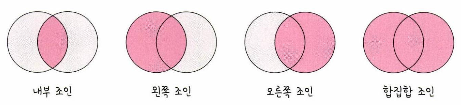

# 내부 조인

## 조인

두개 이상의 테이블을 묶어서 하나의 결과물을 만드는 것

### 조인의 종류

- 내부 조인: 왼쪽 테이블과 오른쪽 테이블의 두 행이 모두 일치하는 행이 있는 부분만 표기
- 왼쪽 조인: 왼쪽 테이블의 모든 행이 결과 테이블에 표기
- 오른쪽 조인: 오른쪽 테이블의 모든 행이 결과 테이블에 표기
- 합집합 조인: 두 개의 테이블을 기반으로 조인 조건에 만족하지 않는 행까지 모두 표기

### 내부 조인

### 왼쪽 조인

### 오른쪽 조인

### 합집합(외부) 조인

