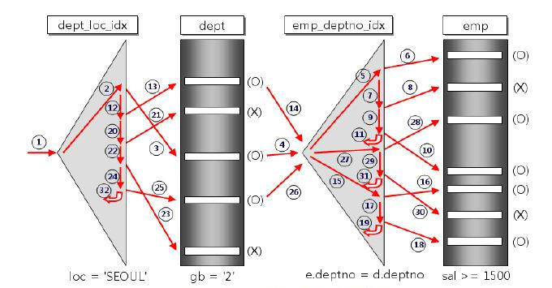

# 중첩 루프 조인

## Nested Loop Join
- 중첩 for 문과 같은 원리로 조건에 맞는 조인 수행
- 랜덤 접근에 대한 비용이 많이 증가 하므로 대용량의 테이블에서는 사용 X
- 예시
  ```
  // t1, t2 테이블을 조인
  for each row in t1 matching reference key {
    for each row in t2 matching reference key {
        if row satisfies join conditions, send to client
    }
  }
  ```
  - t1: Driving Table
  - t2: Driven Table
  - Outer Loop: 한 번만 조회하므로 사이즈가 크지 않으면 인덱스 안써도 Full Scan가능
  - Inner Loop: Outer의 한 행마다 Driven Table에서는 Full Scan할 수 있으므로 인덱스 설정하는 것이 좋음



## Block Nested Loop Join
- 기존 NL은 1:1 방식이었다면 BNL은 N:1 방식
- Driving Table에서 버퍼에 N개의 레코드를 저장 후 버퍼에 있는 레코드들과 Driven Table 스캔하면서 조인 수행
- Table에 대한 접근 횟수는 줄어드나, 버퍼를 사용하기 때문에 메모리 사용률이 증가


[참고 자료]
- NL: https://coding-factory.tistory.com/756
- BNL: https://hoing.io/archives/24491 