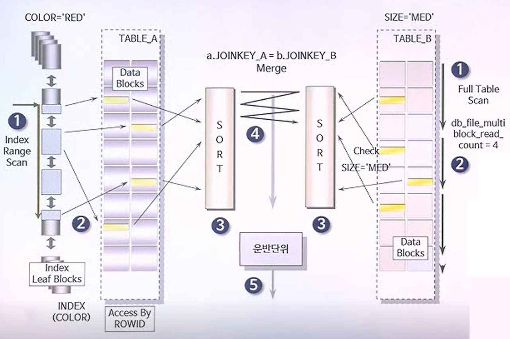

# 정렬 병합 조인

## Sort Merge Join
- 각각의 테이블을 조인할 필드 기준으로 정렬 후 조인 수행
- 조인할 때 쓸 적절한 인덱스가 없고 대용량의 테이블들을 조인하고 조인 조건으로 <, > 등 범위 비교 연산자가 있을 때 사용

[참고 자료]
- Sort Merge Join: https://coding-factory.tistory.com/757
- https://hyeyul-k.tistory.com/15
