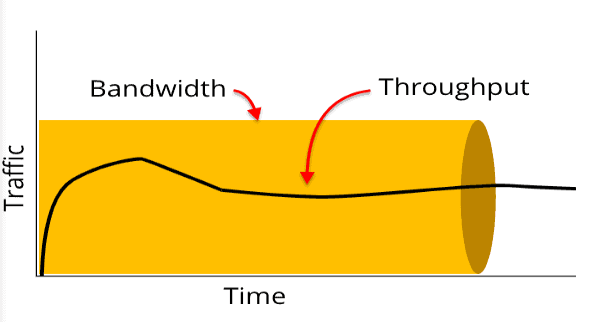
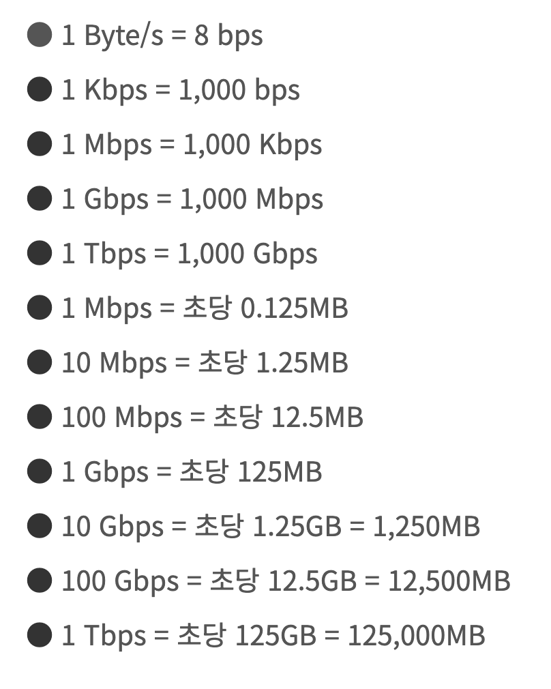
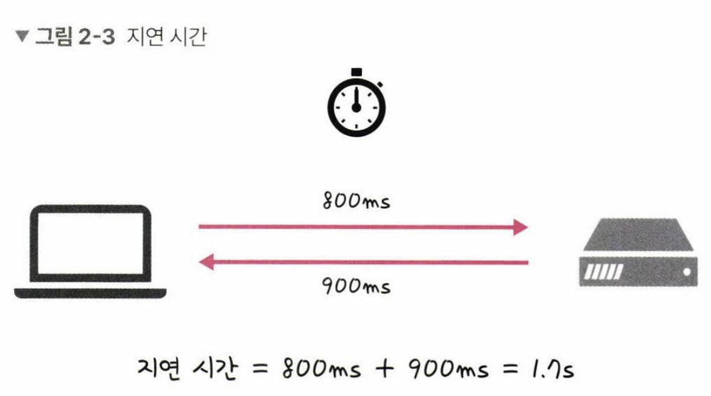

# 네트워크 기초. 처리량과 지연시간

### 네트워크란 ?

- 노드와 링크가 서로 연결되어있거나 연결되어 있지 않은 집합체를 말한다.
- 노드: 서버, 라우터, 스위치 등의 네트워크 장치를 의미
- 링크: 유선 또는 무선

### 처리량과 지연 시간
좋은 네트워크는 처리량이 높고 지연시간이 짧으며 장애 빈도가 적고 좋은 보안을 갖춘 네트워크를 말한다.  
#### 처리량 (throughput)과 대역폭 (bandwitdth)
  
대역폭: 네트워크에서 주어진 시간 내에 전송될 수 있는 데이터의 최대 용량
처리량: 주어진 시간동안 네트워크 연결을 통해 흐를 수 있는 정확한 비트수  
대역폭이 높을수록 **한번에** 더 많은 데이터를 전송할 수 있음을 의미한다.  

##### 대역폭 단위
대역폭의 단위는 bps(Bits per second)를 사용하며  
1초동안 송/수신할 수 있는 비트 수를 의미한다.
- bps: Bits per second
- Mbps: Megabits per second
- Gbps: Gigabits per second
아래는 bps별 송수신량을 정리한 표 이다.  
  

#### 지연시간 (latency)
network 지연시간(latency)이란 종단간 두 장치 사이 왕복에 걸린 총 시간을 의미한다.  

  
이 경우 네트워크 홉, 장치 스펙, 라우터의 패킷 처리 시간에 영향을 받는다.  

