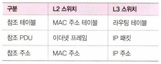

## 2.3.3 인터넷 계층을 처리하는 기기

### 라우터

- 네트워크를 연결, 분할, 구분시켜주는 역할
- 서로 다른 네트워크(IP 대역이 다른)에 존재하는 장치끼리 서로 데이터를 주고받을 수 있게함
- 패킷 소모를 최소화하고 최적화하여 최소 경로로 패킷을 포워딩
    
    ※ 포워딩: 패킷을 받고, 보내는 작업 / 라우팅: 출발지부터 도착지까지 이동하는 경로를 짜는 것
    

### L3 스위치

- L2 스위치 + 라우팅 기능
    
    
    
    ※ 그럼 라우터와 L3 스위치는 어떤 차이가 있나? 
    ⇒ 기능면에서는 거의 차이가 없고 가격은 라우터가 조금 더 비싸다고 합니다. 
    ⇒ 보충 자료: [https://m.blog.naver.com/wjw1225/222241663960](https://m.blog.naver.com/wjw1225/222241663960) 
