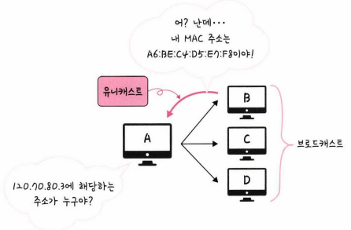

## 2.4.1 ARP(Address Resolution Protocol)

- IP 주소로부터 MAC 주소를 구하는 IP와 MAC 주소의 다리 역할
- ARP: IP ⇒ MAC / RARP(Reverse ARP): MAC ⇒ IP
    
    
    
    - A가 B C D에게 ARP Request ‘브로드캐스트’
    - IP주소가 120.70.80.3인 B가 A에게 ARP reply ‘유니캐스트’
    ⇒ 이 때 B의 MAC주소를 패킷에 적어서 보냄
    - A는 결국 해당 IP 주소에 해당하는 B의 MAC 주소를 알게됨
    - ARP: [https://velog.io/@ragnarok_code/ARP-Address-Resolution-Protocol](https://velog.io/@ragnarok_code/ARP-Address-Resolution-Protocol)
    - 캐스팅 종류:  [https://togll.tistory.com/42](https://togll.tistory.com/42)
    
- 만약, 외부 네트워크의 클라이언트와 통신을 할 땐 ARP가 어떻게 동작하는가?
    - A가 B에게 ICMP request 패킷 전송
    - A와 게이트웨이와의 ARP 통신
    - 게이트웨이와 B와의 ARP 통신
    - B가 A에게 ICMP reply 패킷 전송
    - 외부 ARP: https://blog.naver.com/tmk0429/222301448074 (자세한 과정 설명되어 있음)