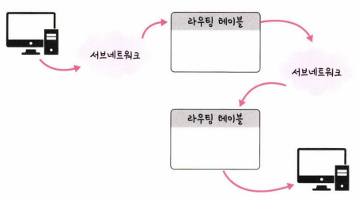
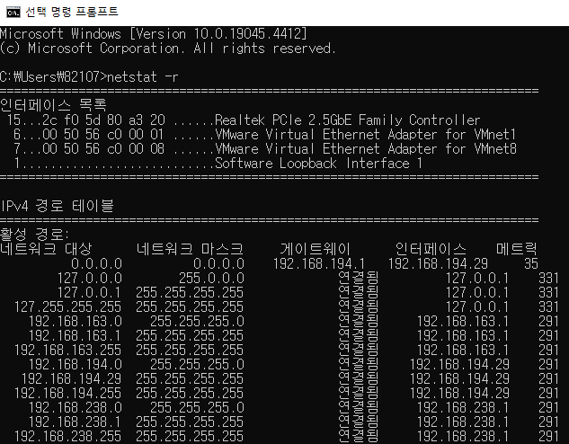

## 2.4.2 홉바이홉 통신

- 홉(hop): 건너뛰는 모습
⇒ 통신망에서 각 패킷이 여러 개의 라우터를 건너가는 모습을 비유적으로 표현
- 라우팅 테이블의 IP를 통해 시작 주소부터 다음 IP로 계속 이동하는 라우팅 과정을 거쳐 최종 목적지까지 도달하는 통신
    
    
    

- 라우팅 테이블: 라우터에 들어가 있는 목적지 정보들과 그 목적지로 가기 위한 방법이 들어 있는 리스트 ⇒ 목적지에 도달하기 위해 거쳐야 할 다음 라우터의 정보를 가지고 있음
- 게이트웨이(Gateway): 서로 다른 통신망, 프로토콜을 사용하는 네트워크 간의 통신을 가능하게 하는 관문 역할을 하는 ‘컴퓨터’나 ‘소프트웨어’
※ 윈도우 cmd에서 `netstat -r` 명령어를 입력하면 게이트웨이 및 라우팅 테이블 확인 가능
    
    