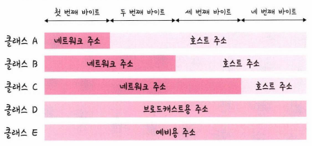
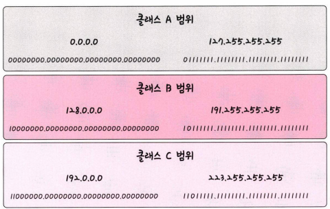
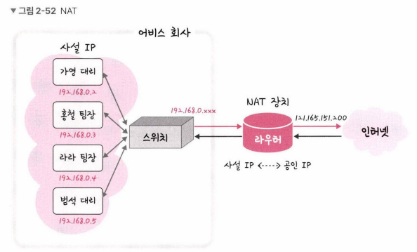

## 2.4.3 IP 주소 체계

- IPv4: 32비트를 8비트 단위로 점을 찍어 표기
ex) 123.45.67.89
- IPv6: 64비트를 16비트 단위로 점을 찍어 표기
ex) 2001:db8::ff00:42:8329
- 클래스 기반 할당 방식(Classful Addressing)
    
    
    
    
    
    - 클래스 A: 첫 번째 바이트 0으로 시작
    - 클래스 B: 첫 번째 바이트 10으로 시작
    - 클래스 C: 첫 번째 바이트 110으로 시작
    
    - 네트워크의 첫 번째 주소는 해당 네트워크 대역 주소
    - 네트워크의 마지막 주소는 브로드캐스트용 주소
    
- DHCP(Dynamic Host Configuration Protocol)
    - IP 주소 및 기타 통신 매개변수를 자동으로 할당하기 위한 네트워크 관리 프로토콜

- NAT(Network Addres Translation)
    - IPv4 주소 체계만으로 많은 주소들을 감당할 수 없음
    - 공인 IP와 사설 IP로 나눠서 많은 주소 처리
        
        ex) 공인 IP: 공유기 자체 주소 / 사설 IP: 공유기로부터 할당 받은 주소
        
        
        
    
    - 단점: 실제로 접속하는 호스트 숫자에 따라서 접속 속도가 느려질 수 있음