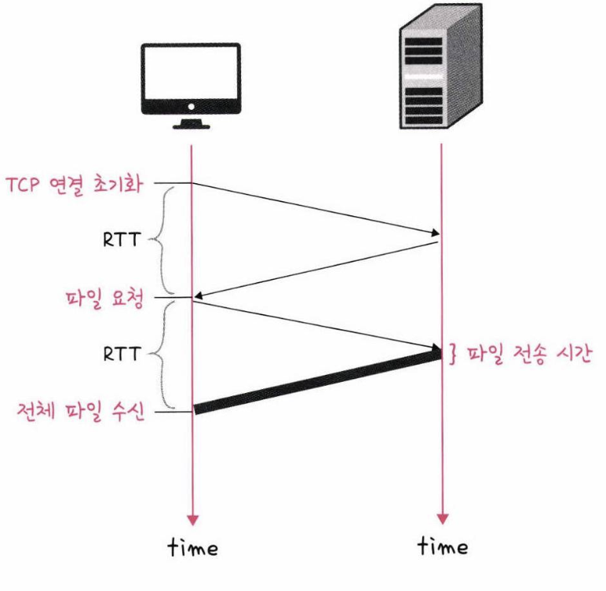
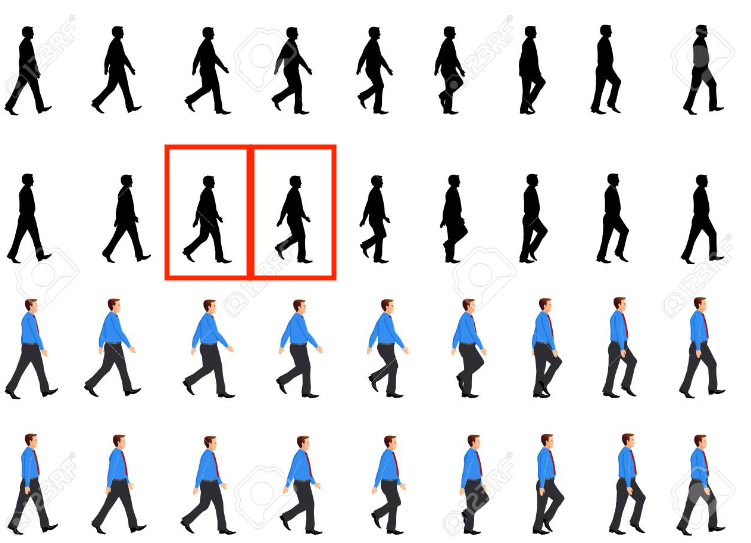
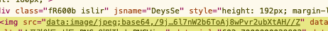

# HTTP/1.0

HTTP/1.0은 1996년도 부터 보편적으로 사용되기 시작했으며  
HTTP/1.0은 한 연결당 하나의 요청을 처리하도록 설계되었다.  
이는 서버로부터 리소스를 가져올 떄 마다 TCP 3-way-handshake를 계속해서 진행해야했고 이는 RTT의 증가로 이어지는 단점이 있었다.  
> RTT(Round Trip Time): 패킷이 목적지에 도달하고 난 뒤 다시 출발지로 돌아오기까지 걸리는 시간이며 패킷 왕복 시간  
  

## HTTP/1.0에서 RTT 증가를 해결하기 위한 방법
- 이미지 스플리팅
- 코드 압축
- 이미지 Base64 인코딩

### 이미지 스플리팅
HTTP/1.0 특성상 많은 이미지를 다운받게 되면 과부하가 걸리기 때문에  
스프라이트 이미지를 한개 다운받고 css의 background-image position을 사용해서 이미지를 표시하는 방법이다.  
  
위와같은 이미지를 스프라이트 이미지라고 하는데 일정 격자 크기만큼 이미지를 합쳐놓고 코드상에서 잘라쓰는 방식이다.  
```css

a {
  background-image: url("sprite.png")
  width: 25px;
  height: 25px;
  repeat: no-repeat;
}

a:nth-child(1) {
  background-position: 2px -8px;
}
```

### 코드 압축
코드 압축은 개행 문자, 빈칸을 없애서 코드의 크기를 최소화 하는 방법이다.  
```javascript
const express = require('express');
const app = express();
const port = 3000;

app.get('/', (req, res) => {});

app.listen(port, () => {});
```
앞의 코드를 다음과 같은 코드로 바꾸는 방법이다.  
```javascript
const express=require('express'),app=express(),port=3e3;app.get('/', (e,p)=>{}),app.listen(3e3,()=>{});
```
개행과 변수명 등 최대한으로 코드량을 줄여 압축시킨 모습이다.  
이렇게 되면 코드 용량이 줄어들어 리소스를 패치할 떄 좀더 효율적으로 통신이 가능해진다.  

### 이미지 Base64 인코딩
이미지 파일을 Base64 문자열로 인코딩 하는 방법이다.  
이 방법을 사용하면 이미지에 대해 서버에 요청을 할 필요가 없다는 장점이 있지만.  
37%정도 코드량이 증가한다는 단점이 있다.  
  

