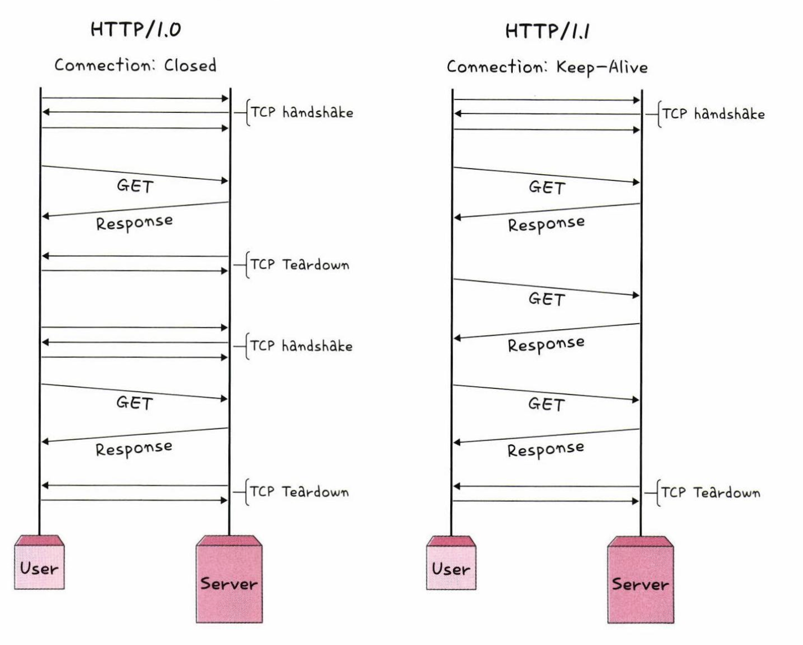
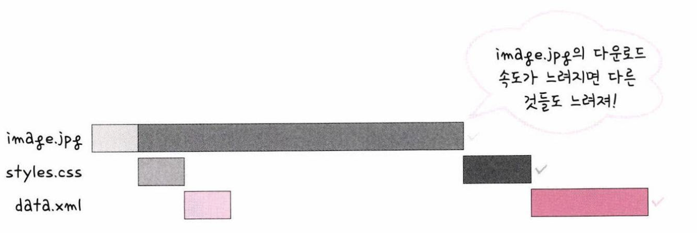

# HTTP/1.1
HTTP/1.0에서 발전한 것이 HTTP/1.1  
1.0과 달리 매번 TCP를 연결하는 것이 아니라 **한번 TCP 초기화를 한 이후에 keep-alive 라는 옵션으로 여러개의 파일을 송수신할 수 있게 바뀌었다.**  
1.0에도 keep-alive 옵션이 있었지만 HTTP/1.1부터 표준화가 되었음  
  
3 way handshake가 발생하면 그 다음부터 발생하지 않는다.  
하지만 html에 포함된 다수의 리소스(이미지, css, js)를 처리하려면  
요청할 리소스 개수에 비례해서 대기 시간이 길어지는 단점이 있다.  

## HOL Blocking (Head Of Line Blocking)  
같은 스트림에 있는 패킷이 그 첫번째 패킷에 의해 지연될 때 발생하는 성능 저하를 말한다.  
  

## 무거운 헤더
HTTP/1.1의 헤더에는 쿠키 등 많은 메타 정보들이 들어있고 압축이 되지 않아 무거웠다.  
