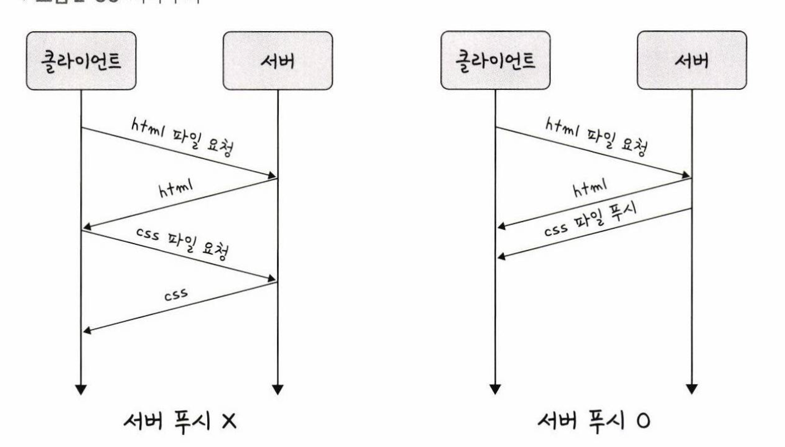

# HTTP/2.0

HTTP/2.0은 HTTP/1.x 보다 지연시간을 줄이고 응답 시간을 더 빠르게 할 수 있으며 멀티플렉싱, 헤더 압축, 서버 푸시, 요청의 우선순위 처리를 지원하는 프로토콜 이다.  
HTTP/2.0 은 SPDY라는 프로토콜에서 파생되었다.  
  

## 멀티플렉싱
- 멀티플렉싱은 여러개의 스트림을 이용하여 송수신 하는 것  
> 스트림: 데이터의 흐름  

  
- 하나의 연결 내 여러 스트림을 캡쳐한 모습이다.  
- 애플리케이션에서 받아온 메시지를 독립된 프레임으로 조각내어 서로 송수신한 이후 다시 조립하여 데이터를 주고 받는다.  

- HTTP/1.1 에서는 리소스당 한 커넥션을 차지했다.  
- HTTP/2.0 에서는 한개의 커넥션으로 스트림 통신을 하는 것을 알 수 있다.  
단일 연결을 사용하여 병렬로 여러 요청을 처리할 수 있기때문에 1.1에서 발생하는 HOLB를 해결할 수 있다.  
## 헤더 압축
HTTP/1.1 에는 크기가 큰 헤더 라는 문제가 있었다.  
이를 HTTP/2 에서는 헤더 압축을 써서 해결하는데 이때 사용하는 압축 알고리즘은 HPACK 이다.  
HTTP 헤더에는 요청마다 반복되는 내용이 많으므로 헤더 압축만으로도 충분한 성능 향상 효과를 얻을 수 있다.  
Google의 발표 자료에 따르면 HTTP 헤더 압축으로 최초 요청 시에도 10~35%의 크기를 감소시킬 수 있고, 여러 번 요청이 있을 경우에는(long-lived 커넥션) 80~97%까지 헤더 크기를 감소시킬 수 있다고 한다. 또한 모바일과 같이 업로드 대역폭이 상대적으로 작은 경우에는 이런 HTTP 헤더 압축 방법이 특히 유용하다. 오늘날의 HTTP 헤더는 평균 2KB 가량이고, 점점 더 커지는 추세이기 때문에 HTTP 헤더 압축의 가치는 앞으로는 더 커질 것이라고 보고 있다.
### 허프만 코딩
문자열을 문자 단위로 쪼개 빈도수를 세어 빈도가 높은 정보는 적은 비트 수를 사용하여 표현하고  
빈도가 낮은 정보는 비트 수를 많이 사용하여 표현하여 전체 데이터의 표현에 필요한 비트양을 줄이는 원리.   
## 서버 푸시
1.1 에서는 클라이언트가 서버에 요청을 해야 파일을 받을 수 있었다.  
HTTP/2는 클라이언트 요청 없이 서버가 바로 리소스를 푸시할 수 있다.  
  
html에는 css나 js파일이 포함되기 마련인데 html을 읽으면서 그안에 있던 css 파일을 서버에서 푸시하여 클라이언트에 먼저 줄 수 있다.  
