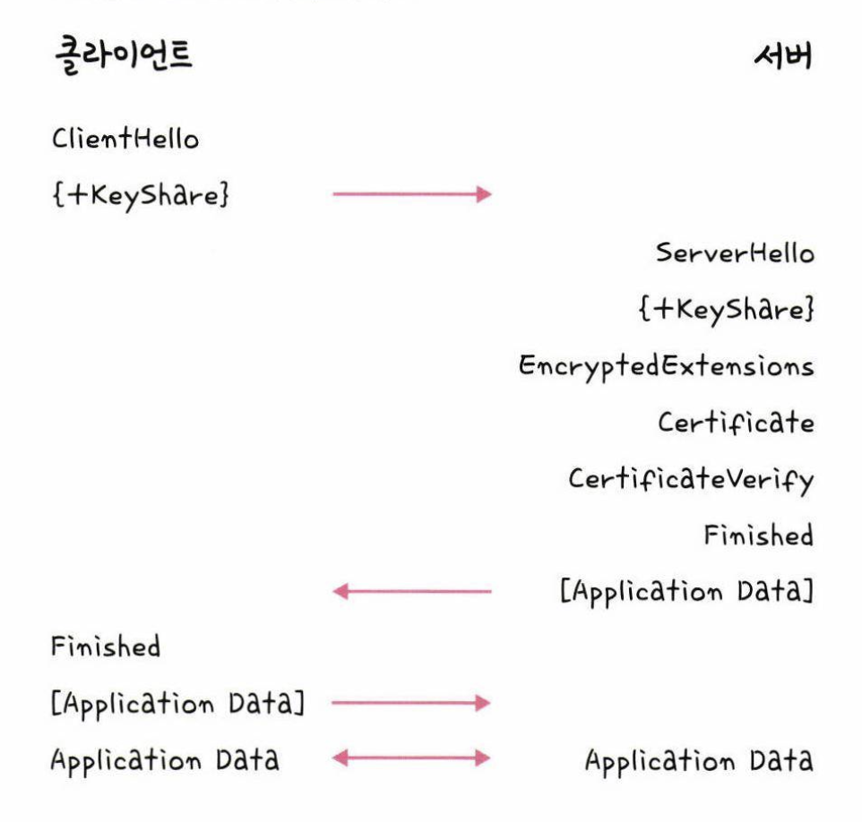

# HTTPS
HTTP/2는 HTTPS 위에서 동작한다.  
HTTPS는 통신간 암호화 하는 것을 말한다.  

## SSL/TLS
- SSL(Secure Socket Layer)  
- TLS(Transport Layer Security Protocol)  
- SSL과 TLS는 이름만 다르지 똑같은 개념이다. 그래서 SSL/TLS로 불린다.  
- SSL/TLS는 전송 계층에서 보안을 제공하는 프로토콜이다.  
- 클라이언트와 서버가 통신할 때 SSL/TLS를 통해 제3자가 메시지를 도청하거나 변조하지 못하도록 한다.  
- SSL/TLS는 보안 세션을 기반으로 데이터를 암호화한다.  
- 인증 메커니즘, 키 교환 암호화 알고리즘, 해싱 알고리즘을 이용한다.  
### 보안세션
- 보안 세션이란 보안이 시작되고 끝나는 동안 유지되는 세션을 말한다.  
- SSL/TLS는 handshake를 통해 보안 세션을 생성하고 이를 기반으로 상태 정보 등을 공유한다.  

### TLS Handshake
클라이언트는 서버의 인증서를 받아 서버의 무결성을 확인하고 신뢰할 수 있는 서버라면 암호화 통신에 사용할 대칭 키를 서버의 공개키로 암호화 하여 전달한다.  
즉 데이터를 주고받기 전, 서버의 무결성을 확인하고 대칭키를 전달하는 과정이 **TLS Handshake**이다.  
  
#### 1. Client: Client Hello
클라이언트가 서버로 Client Hello 메시지를 전송한다.  
패킷 내에는 TLS Version, Client가 지원하는 암호화 방식, Client Random Data, Session Id, SNI(서버 이름)가 포함된다.  
> SessionId: 매번 연결할때마다 handshake를 할 수 없으니 최초 1회 handshake 이후 부여되는 세션 식별자 연결 성립 이후 session id를 이용하여 handshake를 하지 않는다.  

#### 2. Server: Server Hello
클라이언트가 보낸 Client Hello에 대한 응답.  
TLS Version, 암호화 방식 (사이퍼 수트에 대한 서버가 사용 가능한 암호화 방식을 선택), Server Random Data(서버에서 생성한 난수, 대칭키를 만들 떄 이용), Session Id  

#### 3. Server: Server Certificate
서버의 인증서를 클라이언트에게 보내는 단계, 필요에 따라 CA의 Certiciate도 함께 전송한다.  
클라이언트는 이 패킷을 통해 서버의 인증서가 무결한지 검증한다.  

#### 4. Client: Client Key Exchange
인증서가 무결한지 검증되었다면 클라이언트의 난수와 서버의 난수를 조합하여 대칭키를 생성한다.  
그리고 대칭키를 서버의 공개키로 암호화 한다.  
암호화 한 정보를 서버에 전송한다.  
키 교환에 필요한 정보를 서버에 제공한다.  

#### 5. Server, Client: Change Cipher Spec
이제부터 전송되는 모든 패킷은 협상된 알고리즘과 키를 이용하여 암호화 하겠다고 알리는 메시지  

