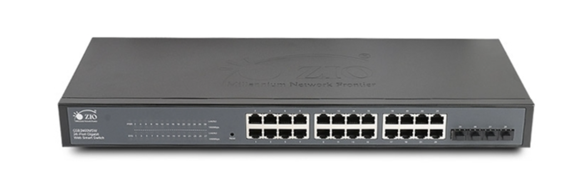
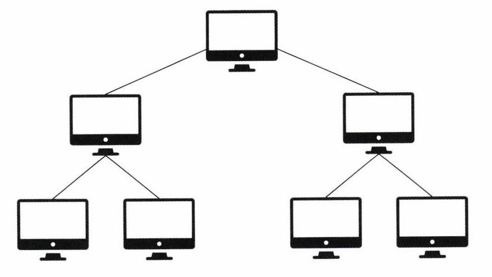
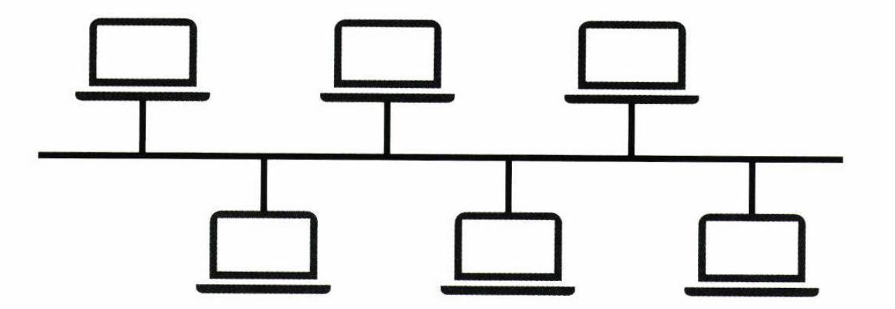
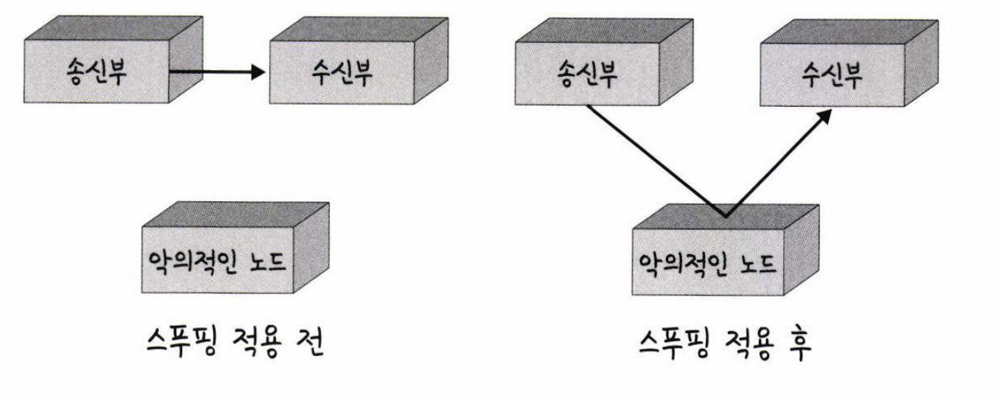
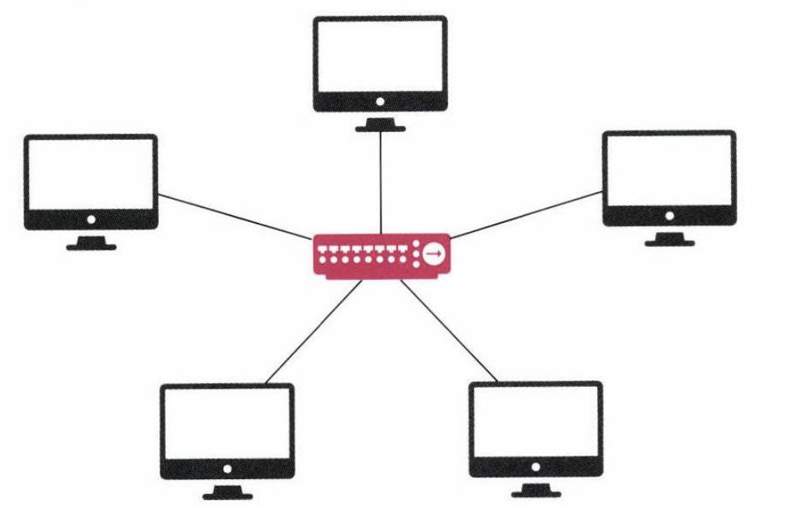
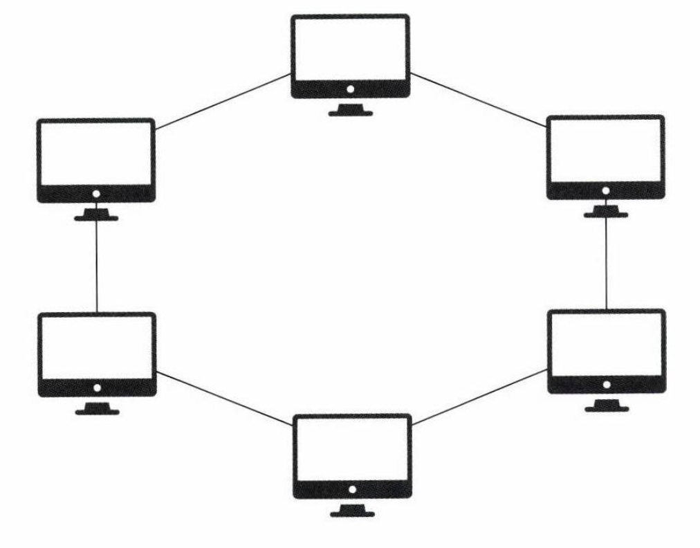
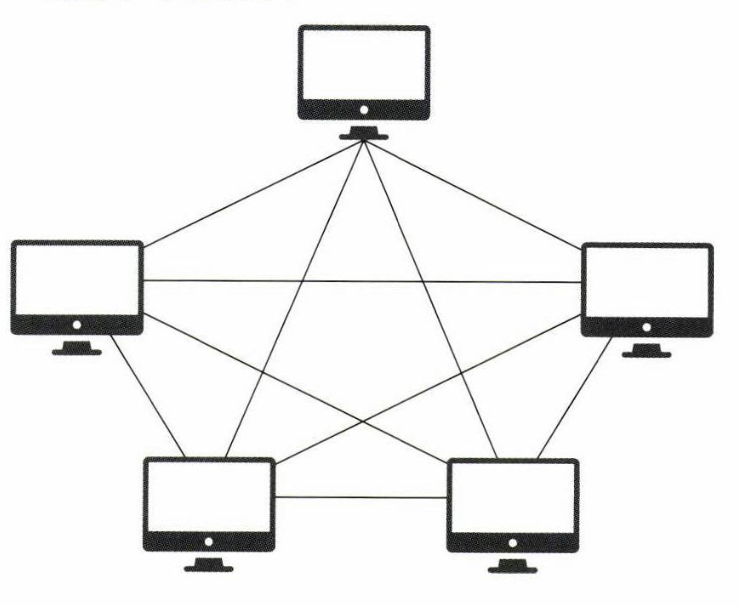

# 네트워크 기초. 네트워크 토폴로지와 병목 현상 

### 네트워크 토폴로지
**네트워크 토폴로지는 노드와 링크가 어떻게 배치되어 있는지에 대한 방식이자 연결 형태...**  
컴퓨터 네트워크들의 요소들 (링크, 노드 등)을 **물리**적으로 연결 해놓은 것 또는 연결 방식  
즉, 네트워크 상에서 호스트나 장치를 어떤 형태들로 연결되어 있는지 보여주는 연결 방식
네트워크 토폴로지의 형태는 아래와 같이 존재함.  

- 트리 토폴로지
- 버스 토폴로지
- 스타 토폴로지  
- 링형 토폴로지
- 메시 토폴로지

### 토폴로지를 설명하기 전에 허브란?

여러대의 컴퓨터를 연결해서 같은 네트워크를 만들어주는 장치이다.  
허브에 몇개의 포트가 있느냐에 따라 N포트 허브로 말하며 각 포트에는 컴퓨터를 연결할 수 있다.  
이렇게 허브에 연결된 각 컴퓨터는 하나의 네트워크를 형성한다.  

#### 트리 토폴로지
  
트리 형태로 배치한 네트워크 구성을 말한다.    
장점: 노드의 추가, 삭제가 쉽다  
단점: 한개의 허브에 문제가 생기면 해당 허브에 연결된 모든 장치는 영향을 받을 수 있음  
**기업 네트워크나 데이터 센터에서 주로 구성됨**  

### 버스 토폴로지
  
중앙 통신 회선 하나에 여러 개의 노드가 연결되어 공유하는 네트워크 구성을 말한다.  
근거리 통신망(LAN)에서 사용한다.  
케이블은 허브에 연결되어 있으며, 데이터는 케이블을 통해 모든 장비에 동시 전송 된다.  

장점: 구성이 간단하고 저렴함 -> 따라서 LAN 같은 작은 통신망에 적합하다.  
단점: 케이블에 문제가 생기면 전체 네트워크로 장애가 퍼진다, 데이터 충돌이 발생하기 쉽다, 확장성이 낮다. 스푸핑이 가능하다.  
#### 스푸핑
스푸핑은 LAN 상에서 송신부의 패킷을 송신과 관련 없는 다른 호스트에 가지 안혿록 하는  
스위칭 기능을 마비시키거나 속여서 특정 노드에 해당 패킷이 오도록 처리하는 것을 말한다.  
  
위 그림처럼 올바르게 수신부로 가야 할 패킷이 악의적인 노드에 전달되고  
악의적인 노드에서 패킷을 감청하거나 잘못된 패킷으로 변조하여 수신부에 전송할 수 있다.  

### 스타 토폴로지
  
중앙에 있는 네트워크 장치(허브)에 모든 노드들이 연결되어 있는 네트워크 구성을 말한다.  

장점: 관리가 용이하다, 한 노드의 장애가 전체 네트워크로 퍼지지 않는다, 확장이 쉽다, 설치 비용이 많이 든다.  
단점: 중앙 네트워크 장치(허브)가 고장나면 전체 네트워크가 마비된다.  

현재 가장 일반적으로 사용되는 형태 중 하나이며, 이더넷 네트워크에서 많이 사용된다.  
#### 이더넷
이더넷은 원칙적으로 하나의 인터넷 회선에 유/무선 통신장비 공유기, 허브 등을 통해 다수의 시스템이 랜선 및 통신포트에   연결되어 통신이 가능한 네트워크 구조를 말한다.  

### 링형 토폴로지
  
각각의 노드가 양 옆의 두 노드와 연결하여 전체적으로 고리처럼 하나의 연속된 길을 통해 통신을 하는 망 구성 방식  
각 호스트들은 자신의 양쪽 호스트와 전용으로 점 대 점으로 연결되어 있다.  
각각의 노드는 고리 모양의 길을 통해 패킷을 처리한다.  

장점: 장애 발생 호스트를 쉽게 찾음, 호스트의 수가 늘어나도 네트워크 성능에는 별로 영향을 미치지 않음  
단점: 네트워크 구성 변경이 어려움, 한 회선의 장애 발생 시 전체 네트워크에 영향을 끼침, 링을 제어하기 위한 절차가 복잡함, 새로 호스트를 추가하기 위해서는 물리적으로 링을 절단하고 호스트를 추가해야함  

주로 인터넷 백본 네트워크나 도시 간 통신망 등에서 사용된다.

#### 이중 링 토폴로지
두 개의 독립적인 링이 존재하며 각각의 노드는 이 두 링에 모드 연결된다.  
주 링과 보조 링으로 구분되고 주 링의 문제 발생 시 보조 링이 이를 대체해서 가용성을 유지한다.  

### 메시 토폴로지

그물망 처럼 연결되어 있는 구조의 네트워크 연결  
각 노드들이 직접적으로 상호 연결되어 그물처럼 연결되어 있는 형태이다.  
한 장치에 장애가 발생하여도 여러 경로를 선택할 수 있으므로 가용성이 높다.  
하지만 노드의 추가가 어렵고 비용이 비싸다.  

가용성이 높아야 하는 시스템에 사용된다: 군사, 재난 관련 시스템, 자율 주행 자동차 네트워크

장점: 가용성이 높다.  
단점: 비싸다.  

### 토폴로지가 중요한 이유
**병목 현상을 찾을 때 중요한 기준이 되기 때문**  

