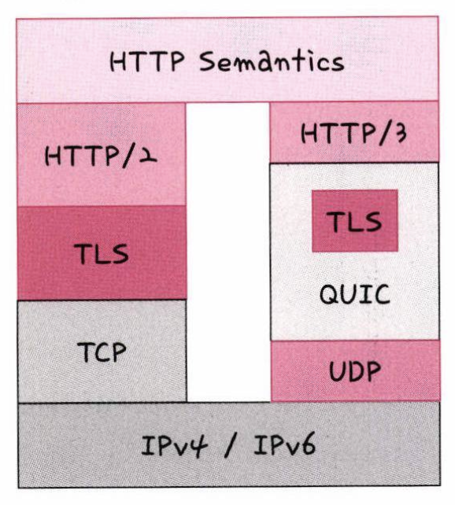

# HTTP/3

UDP기반의 QUIC 계층 위에서 돌아가는 HTTP 프로토콜  
HTTP/2의 장점인 멀티플렉싱을 가지고 있다.  

  

  
UDP 기반으로 돌아가기 때문에 TCP의 3-way-handshake 과정을 거치지 않아 초기 연결 속도가 빠르다.  
다만 UDP의 특징인 패킷이 제대로 전송되었는지 확인하지 않는 것은 순방향 오류 수정 매커니즘(FEC)이 적용되어 있다.  
이는 전송한 패킷이 손실 되었다면 수신 측에서 에러를 검출하고 수정하는 방식이다.  
QUIC 는 TCP의 매커니즘을 구현하여, UDP 기반이어도 안정적인 통신이 가능하다.
