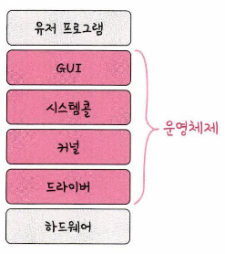
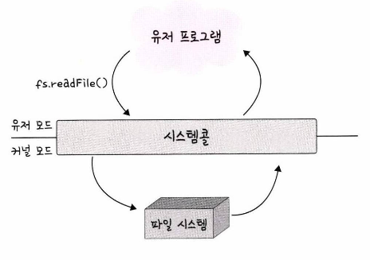
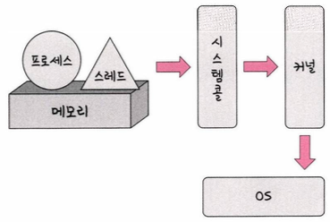
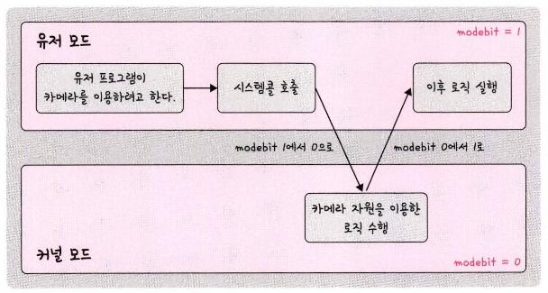
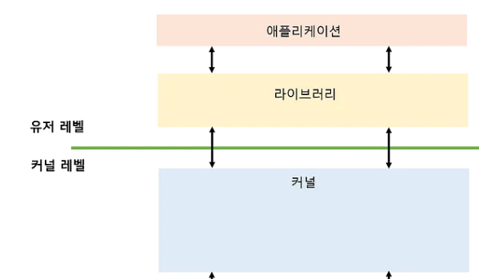

# 운영체제의 역할과 구조

## 운영체제의 역할

### 1. CPU 스케줄링과 프로세스 관리

CPU 소유권을 어떤 프로세스에 할당할지에 대해 결정, 프로세스의 생성/삭제, 자원 할당/반환을 관리

### 2. 메모리 관리

한정된 메모리를 어떤 프로세스에 얼만큼 할당해야 하는지를 관리

### 3. 디스크 파일 관리

디스크 파일을 어떤 방법으로 보관할지 관리

### 4. I/0 디바이스 관리

마우스, 키보드와 컴퓨터 간에 데이터를 주고받는 것을 관리

---

## 운영체제의 구조

### 1. GUI

사용자가 전자장치와 상호 작용할 수 있도록 하는 사용자 인터페이스의 한 형태(예: 윈도우), GUI의 반대인 명령어로만 처리하는 인터페이스인 CUI(CLI)가 있음 (예: 리눅스)

### 2. 시스템콜

운영체제가 커널에 접근하기 위한 인터페이스이며 유저 프로그램이 운영체제의 서비스를 받기 위해 커널 함수를 호출할 때 사용

유저 프로그램이 I/O 요청으로 트랩을 발동하면 올바른 I/O 요청인지 확인한 후 유저 모드가 시스템콜을 통해 커널 모드로 변환되어 실행됨

프로세스, 스레드, 운영체제로 어떠한 요청을 할 때 시스템콜 이라는 인터페이스와 커널을 거쳐 OS로 전달

*시스템콜 예시: [https://hasumang.tistory.com/6](https://hasumang.tistory.com/6)

- **modebit**: 시스템 콜이 작동될 때 유저 모드와 커널 모드를 구분하는 역할로, 1또는 0의 값을 가지는 플래그 변수, 모든 입출력장치가 운영체제를 거쳐서 작동 가능하게함으로써 보안 상의 이유로 사용되는 변수
- modebit: **0**: 유저모드 / **1**: 커널 모드
    - 유저 모드: 유저가 접근할 수 있는 영역을 제한적으로 두며 컴퓨터 자원에 함부로 침범하지 못하는 모드
    - 커널 모드: 모든 컴퓨터 자원에 접근 가능한 모드

### 3. 커널

운영체제의 핵심 부분이자 시스템콜 인터페이스를 제공하며 보안, 메모리, 프로세스, 파일 시스템, I/O 디바이스, I/O 요청 관리등 운영체제의 중추적인 역할

- 한정된 시스템 자원을 효율적으로 관리하여 프로그램의 원활한 실행을 도움

### 전체 Flow 예시

1. 애플리케이션 코드(유저 프로그램) 실행 → read(fd,buffer,n);

1. 라이브러리에서 CPU의 특정 레지스터 안에 read 시스템 호출을 뜻하는 호출 번호와 파라미터를 삽입

1. sysenter 명령을 실행하면 CPU는 커널 모드로 전환됨

1. trap 발생 → system_call_handler() 실행

1. 현재 CPU의 레지스터들을 커널 스택에 복사하고, CPU 의 특정 레지스터를 읽어 시스템 호출 번호를 알아냄

1. 시스템 호출 번호에 있는 커널 함수를 부른다. → sys_read();

1. 커널 함수가 해당하는 디스크를 작동시켜서 데이터를 읽어와서 buffer에 저장

1. 커널 스택에 저장해둔 레지스터들을 CPU에 복귀시킴

1. 커널모드를 빠져나감

1. 버퍼에 있는 데이터를 읽음