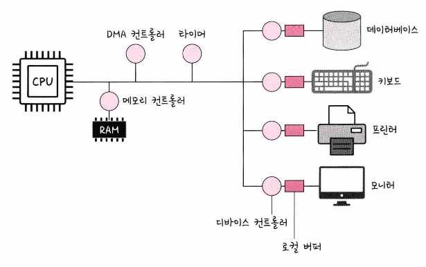
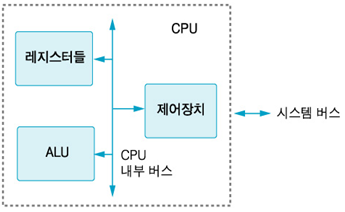
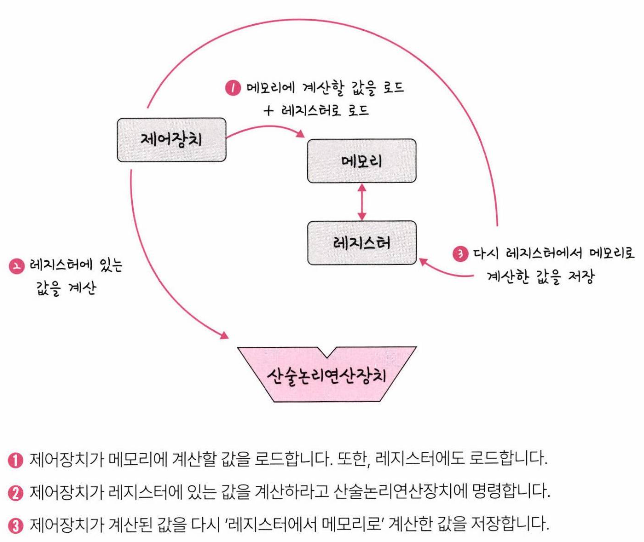

# 컴퓨터의 요소

---

## 1. CPU

산술논리연산장치, 제어장치, 레지스터로 구성되어 있는 컴퓨터 장치

### 제어장치

프로세스 조작을 지시하는 CPU의 한 부품

- 입출력장치 간 통신 제어, 명령어들을 읽고 해석하여 데이터 처리를 위한 순서 결정

### 레지스터

CPU 안에 있는 매우 빠른 임시기억장치

- CPU와 직접 연결되어 있어 연산 속도가 메모리보다 수십~수백배 빠름
- CPU는 데이터를 저장할 방법이 없기 때문에 레지스터를 거쳐 데이터를 저장

### 산술논리장연산장치(ALU)

덧셈, 뺄셈 같은 두 숫자의 산술 연산과 배타적 논리합, 논리곱 같은 논리 연산을 계산하는 디지털 회로

### CPU의 연산 처리

연산처리 Detail: [https://maloveforme.tistory.com/152](https://maloveforme.tistory.com/152)

### 인터럽트

어떤 신호가 들어왔을때 CPU를 잠깐 정지시키는 것을 말합니다. 

- 키보드, 마우스 등 IO 디바이스로 인한 인터럽트
- 0으로 숫자를 나누는 산술 연산에서의 인터럽트
- 프로세스 오류 등으로 인한 인터럽트

---

## 2. DMA 컨트롤러 → 추가 설명

I/O 디바이스가 메모리에 직접 접근할 수 있도록 하는 하드웨어 장치

- CPU에 너무 많은 인터럽트 요청이 들어오기 때문에 CPU 부하를 막아주며 CPU의 일을 부담하는 보조 역할

---

## 3. 메모리

전자회로에서 데이터나 상태, 명령어 등을 기록하는 장치, RAM을 일컬어 메모리라고도 부름

---

## 4. 타이머

몇 초 안에는 작업이 끝나야 한다는 것을 정하고 특정 프로그램에 시간 제한을 다는 역할

- 시간이 많이 걸리는 프로그램이 작동할 때 제한을 걸기 위해 존재

---

## 5. 디바이스 컨트롤러

컴퓨터와 연결되어 있는 IO 디바이스들의 작은 CPU