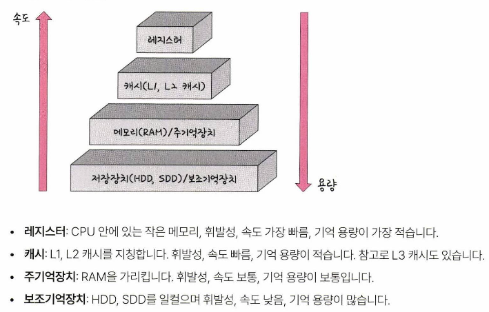
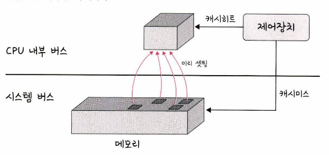
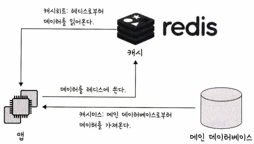

# 메모리 계층

- 램은 저장장치(HDD, SSD)로부터 일정량의 데이터를 복사해서 임시 저장하고 이를 필요시마다 CPU에 빠르게 전달하는 역할
- 계층이 위로 올라갈수록 가격이 비싸며, 용량이 작아지고 속도가 빨라짐

---

## 1. 캐시

데이터를 미리 복사해 놓는 임시 저장소이자 빠른 장치와 느린 장치에서 속도 차이에 따른 병목 현상을 줄이기 위한 메모리

- 실제로 메모리와 CPU 사이의 속도 차이가 너무 크기 때문에 중간에 레지스터를 두어 속도 차이를 해결함.
이러한 속도 차이를 해결하기 위해 계층과 계층 사이에 있는 계층을 캐싱 계층이라고 부름

### 캐시 Hit / 캐시 Miss

필요한 데이터를 캐시에서 찾으면 **캐시 Hit**, 데이터가 없어서 주메모리로 가서 데이터를 찾아오는 것을 **캐시 Miss** 라고 부름

- 캐시 Hit 발생 시 해당 데이터를 제어장치를 거쳐 가져오게 되는데, 위치도 가깝고 CPU 내부 버스를 기반으로 작동하기 때문에 속도가 빠름
- 캐시 Miss 발생 시 메모리에서 데이터를 가져오며, 시스템 버스를 기반으로 작동하기 때문에 속도가 느림

### 시간적 지역성(Temporal Locality)

최근에 참조된 주소의 내용은 곧 다음에 다시 참조되는 특성

- 메모리 상의 같은 주소에 여러 차례 읽기 쓰기를 수행할 경우, 상대적으로 작은 크기의 캐시를 사용해도 효율성이 향상

### 공간적 지역성(Spatial Locality)

기억장치 내에 서로 인접하여 저장되어 있는 데이터들이 연속적으로 액세스 될 가능성이 높아지는 특성

- CPU 캐시나 디스크 캐시의 경우 한 메모리 주소에 접근할 때 그 주소뿐 아니라 해당 블록을 전부 캐시에 가져오게 됨
- 이때 메모리 주소를 오름차순이나 내림차순으로 접근한다면, 캐시에 이미 저장된 같은 블록의 데이터를 접근하게 되므로 캐시의 효율성이 크게 향상

### 캐시 매핑

캐시가 히트되기 위해 매핑하는 방법으로, 직접 매핑, 연관 매핑, 집합 연관 매핑 방식이 있음

### 웹 브라우저에서의 캐시

대표적인 캐시로 저장소 쿠키, 로컬 스토리지, 세션 스토리지가 있음

- **쿠키**: 만료기한이 있는 키-값 저장소 (최대 4KB 저장 가능)
    - 클라이언트 또는 서버에서 만료기한을 설정하며 보통 서버에서 설정
- **로컬 스토리지**: 만료기한이 없는 키-값 저장소 (최대 10MB 저장 가능)
    - 브라우저를 닫아도 유지되고 도메인 단위로 저장, 생성
- **세션 스토리지**: 만료기한이 없는 키-값 저장소
    - 탭을 닫을때 삭제되며, 클라이언트에서만 수정 가능

### 데이터베이스의 캐시

