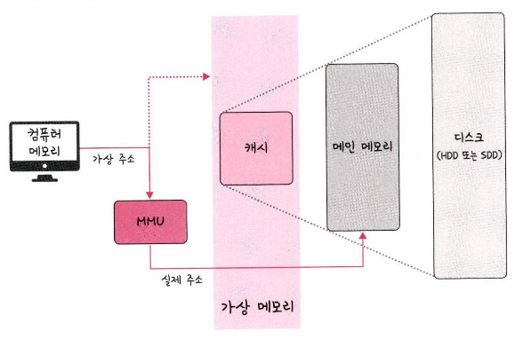
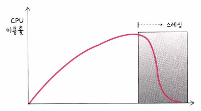
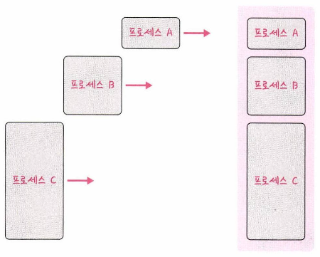
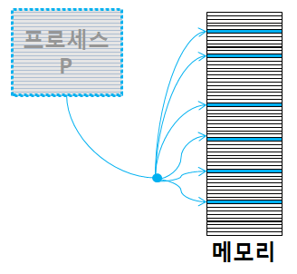
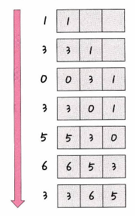

# 메모리 관리

## 가상 메모리

메모리 관리 기법의 하나로 컴퓨터가 실제로 이용 가능한 메모리 자원을 추상화하여 이를 사용하는 사용자들에게 매우 큰 메모리로 보이게 만드는 것

- 가상 주소는 MMU(메모리 관리장치)를 통해 실제 주소로 변환
- 가상 메모리는 가상 주소와 실제 주소가 매핑되어 있고 프로세스의 주소 정보가 들어있는 페이지 테이블로 관리되며, 이때 속도 향상을 위해 TLB를 사용
* **TLB**: 메모리와 CPU 사이에 있는 주소 변환을 위한 캐시

---

## 스레싱

메모리의 페이지 폴트율이 높은 것을 의미, 컴퓨터의 심각한 성능 저하를 초래

***페이지 폴트**: 프로세스의 주소 공간에는 존재하지만 RAM에는 없는 데이터에 접근했을 경우에 발생

- 메모리에 너무 많은 프로세스가 동시에 올라가게 되면 스와핑이 많이 일어나서 발생
- 페이지 폴트가 일어나면 CPU 이용률이 낮아지며, 운영체제는 CPU의 점유율이 낮다고 생각하여 가용성을 높이기 위해 더 많은 프로세스를 올리게 되며 악순환이 반복됨

---

## 메모리 할당

메모리에 프로그램을 할당할 때는 시작 메모리 위치, 메모리의 할당 크기를 기반으로 할당하며 연속 할당, 불연속 할당으로 나뉨

- 연속 할당
    
    
    
    - **고정 분할 방식**: 메모리를 미리 나누어 관리하는 방식
    - 가변 분할 방식: 프로그램의 크기에 맞게 동적으로 메모리를 나누어 관리하는 방식
    **최초적합, 최적적합, 최악적합** 으로 분류됨
        - **First Fit** : 메모리를 할당할 때, 가장 먼저 발견한 곳에 집어넣는 방법
        - **Best Fit** : 메모리를 할당할 때, 사용 가능한 공간 중 가장 작은 곳에 집어넣는 방법. 정렬이 필요
        - **Worst Fit** : 메모리를 할당할 때, 사용 가능한 공간 중 가장 큰 곳에 집어넣는 방법. 정렬이 필요
        *공간 효율성 : Best Fit > First Fit > Worst Fit
        *시간 효율성 : First Fit > Best Fit = Worst Fit
- 불연속 할당
    
    
    
    - 현대 운영체제가 쓰는 방법으로 불연속 할당인 페이징 기법을 사용
    - 메모리를 동일한 크기의 페이지(보통 4KB)로 나누고 프로그램마다 페이지 테이블을 두어 이를 통해 메모리에 프로그램을 할당

- 메모리 단편화 [https://beenii.tistory.com/162](https://beenii.tistory.com/162)

---

## 페이지 교체 알고리즘

### 오프라인 알고리즘

먼 미래에 참조되는 페이지와 현재 할당하는 페이지를  바꾸는 알고리즘이며, 가장 좋은 방법이지만 미래를 알 수 없기 때문에 이론만 존재

### FIFO(First In First Out)

가장 먼저 온 페이지를 교체 영역에 가장 먼저 놓는 방법

### LRU(Last Recently Used)

참조가 가장 오래된 페이지를 바꿈, 오래된 페이지를 파악하기 위해 각 페이지마다 계수기, 스택을 두어야 하는 단점이 있음

### NUR(Not Used Recently)

LRU에서 발전한 알고리즘

- clock 알고리즘이라고 하며 0과 1을 가진 비트를 두고, 시계 방향으로 돌면서 0을 찾고 찾은 순간 해당 프로세스를 교체하고, 해당 부분을 1로 바꾸는 알고리즘
- 0: 참조되지 않음 / 1: 최근에 참조됨