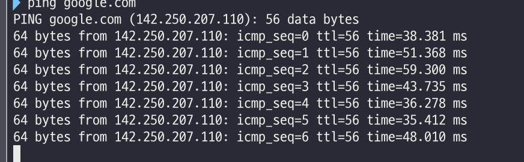
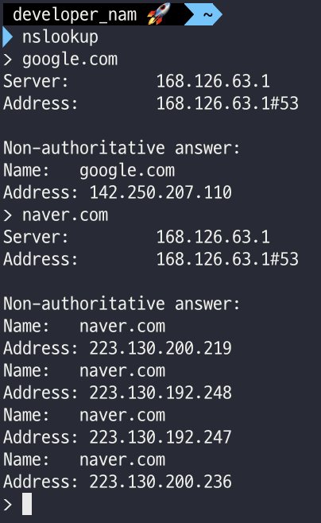

# 네트워크 기초. 네트워크 성능 분석 명령어

### ping(Packet INternet Groper)
ping은 네트워크 상태를 확인하려는 대상 노드를 향해 일정 크기의 패킷을 전송하는 명령어이다.  
이를 통해 해당 노드의 패킷 수신 상태와 도달하기까지 시간 등을 알 수 있으며 해당 노드까지 네트워크가 잘 연결되어 있는지 확인할 수 있다.  
TCP/IP 프로토콜 중 ICMP 프로토콜을 통해 동작하며 이 때문에 ICMP 프로토콜을 지원하지 않는 기기를 대상으로는 실행할 수 없거나  
네트워크 정책상 QICMP나 traceroute를 차단하는 대상의 경우 ping 테스팅은 불가능 하다.  

위 사진은 OSX에서 google.com에 핑을 날려본 사진이다.  
64byte씩 구글에 지속적으로 핑을 보낸다.  

### netstat
netstat 명령어는 접속되어있는 서비스들의 네트워크 상태를 표시하는 데 사용되며 네트워크 접속, 라우팅 테이블, 네트워크 프로토콜 등 리스트를 보여준다.  
주로 서비스의 포트가 열려 있는지 확인할 때 쓴다.  

### nslookup
DNS에 관련된 내용을 확인하기 위해 쓰는 명령어 이다.  
특정 도메인에 매핑된 IP를 확인하기 위해 사용된다.  
  

### tracert, traceroute
윈도우: tracert  
리눅스 계열: traceroute  
목적지 노드까지의 네트워크 경로를 확인할 때 사용하는 명령어 이다.  
목적지 노드 까지 구간들 중 어느 구간에서 응답시간이 느려지는지 등을 확인할 수 있다.  
  

#### 원리
패킷에 TTL(Time to live) 라는 값이 존재하는데.  
이는 네트워크 상에서 라우팅 할 수 있는 홉 수를 의미한다.  
TTL 이 0이 되면 Error를 반환하는데 이 특성을 이용하여 도착지 까지의 경로를 추적할 수 있다.  
1. TTL=1로 하여 패킷을 전송한다.  
2. 첫번쨰 장치에 패킷이 도착하면 TTL 은 0이 되고 에러를 반환하여 첫번째 경로를 알아낸다.  
3. 다음은 TTL=2 로 하여 패킷을 전송한다.  
4. 첫번째 장치에 도착하면 TTL=1 이 되고 그 다음 장치에 도착하면 TTL=0이 되어 에러를 반환하게 되고 두번째 경로를 알아낼 수 있다.  
5. 반복한다.  

위와같은 원리로 도착지 까지의 경로를 알아낼 수 있다.  

