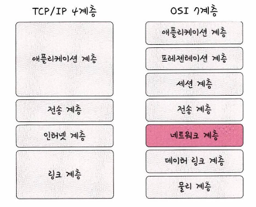
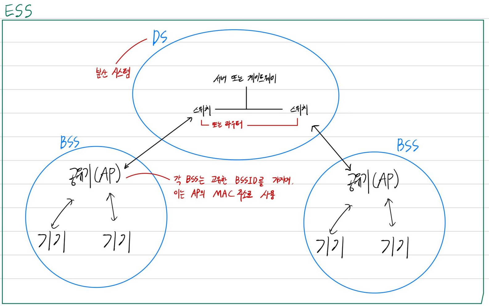

# TCP/IP 4계층 모델

### 인터넷 프로토콜 슈트

- 컴퓨터들이 서로 정보를 주고받는 데 쓰이는 프로토콜의 집합
- TCP/IP 4계층 모델로 설명하거나, OSI 7계층 모델로 설명
- OSI 7계층은 네트워크 통신을 이해하고 설명하는 데 유용한 **개념적 모델**인 반면, TCP/IP 4계층은 실제 인터넷 통신을 위해 개발되었으며 **현실 세계에서 널리 사용되는 모델**

- TCP/IP 4계층
    
    
    

### 1. 애플리케이션 계층

FTP, HTTP, SSH, SMTP, DNS 등으로 구성된 응용 프로그램이 사용되는 계층

- 웹 서비스, 이메일 등 서비스를 실질적으로 사람들에게 제공

> **FTP**
장치와 장치 간의 파일을 전송하는 데 사용되는 표준 통신 프로토콜

**SSH**
보안되지 않은 네트워크에서 네트워크 서비스를 안전하게 운영하기 위한 암호화 네트워크 프로토콜

**HTTP**
World Wide Web을 위한 데이터 통신의 기초이자 웹 사이트를 이용하는 데 쓰는 프로토콜

**SMTP**
전자 메일 전송을 위한 인터넷 표준 통신 프로토콜

**DNS**
도메인 이름과 IP 주소를 매핑해주는 서버
> 

### 2. 전송 계층

송신자와 수신자를 연결하는 통신 서비스를 제공

- 연결 지향 데이터 스트림 지원, 신뢰성, 흐름 제어를 제공
- 대표적으로 TCP, UDP가 있음
- **TCP**
    - 패킷 사이의 순서를 보장하고 연결 지향 프로토콜을 사용해서 연결하여 신뢰성을 구축하고 수신 여부를 확인하며 ‘**가상회선 패킷 교환 방식**’을 사용
    - 웹 브라우징, 이메일, 파일 전송, 원격 접속 등에 사용
- **UDP**
    - 순서를 보장하지 않고 수신 여부를 확인하지 않으며 단순 데이터만 주는 ‘**데이터그램 패킷 교환 방식**’을 사용
    - 실시간 스트리밍 서비스, DNS, DHCP, SNMP, 네트워크 시간 동기화 등에 사용

### 가상회선 패킷 교환 방식

각 패킷에는 가상회선 식별자가 포함되며 모든 패킷을 전송하면 가상회선이 해제되고 패킷들은 전송된 **순서대로** **도착**하는 방식

### 데이터그램 패킷 교환 방식

패킷이 독립적으로 이동하며 최적의 경로를 선택, 하나의 메시지에서 분할된 여러 패킷은 서로 다른 경로로 전송될 수 있으며 도착한 **순서가 다를 수 있는 방식**

<aside>
🌝 **왜 데이터를 여러개의 패킷으로 나눠 보낼까?**
큰 데이터를 보낼 경우 대역폭이 감당하지 못할 수도 있기 때문에

</aside>

### TCP 연결 성립 과정

신뢰성과 정확한 연결성을 확보하기 위해 데이터를 실제로 전송하기 전에 **3-웨이 핸드셰이크 작업**을 진행

1. **SYN**: 클라이언트는 서버에 클라이언트의 ISN을 담아 SYN을 전송
    - **ISN**: 새로운 TCP 연결의 첫 번째 패킷에 할당된 임의의 시퀀스 번호
2. **SYN + ACK**: 서버는 클라이언트의 SYN을 수신하고 서버의 ISN을 보내며 승인번호로 클라이언트의 ISN + 1을 전송
3. **ACK**: 클라이언트는 서버의 ISN + 1한 값인 승인번호를 담아 ACK를 서버에 전송

***SYN Flood Attack**

반개방 공격이라고도 하며, 보낸 SYN 요청에 대한 서버의 SYN-ACK에 응답하지 않고 SYN 요청만 마구잡이로 보내는 네트워크 계층 공격입니다. 결과적으로 많은 수의 열린 TCP Connection으로 인하여 서버의 리소스가 과도하게 소모되어 정상 트래픽의 처리를 어렵게 하면서 정상적인 새로운 Connection을 열 수 없으며, 이미 연결된 사용자의 Connection의 경우에도 서버가 올바르게 작동하기 어렵게 됨

- SYN Flood Attack을 방지하기 위한 방법
    - 비정상적인 트래픽 패턴을 감지하기 위한 IPS 사용
    - SYN 공격의 임계치 설정 및 SYN flooding 탐지와 방어를 위한 **충분한 용량의 방화벽**을 구성
    - 속도 제한(rate limiting) 기능을 사용
    

### TCP 연결 해제 과정

**4-웨이 핸드셰이크 과정**이 발생

1. 클라이언트가 연결을 닫으려고 할 때 FIN으로 설정된 세그먼트를 서버로 전송 후 FIN_WAIT_1 상태로 서버의 응답을 기다림
2. 서버는 클라이언트로 ACK라는 승인 세그먼트를 전송 후 CLOSE_WAIT 상태에 들어감
클라이언트가 세그먼트를 받으면 FIN_WAIT_2 상태에 들어감
3. 서버는 ACK를 전송하고 일정 시간 후에 클라이언트로 FIN이라는 세그먼트를 전송
4. 클라이언트는 **TIME_WAIT** 상태가 되고 다시 서버로 ACK를 전송하며 서버는 CLOSED 상태가 됨
이후 클라이언트는 어느정도의 시간을 대기한 후 연결이 닫히고 클라이언트와 서버의 모든 자원은 연결 해제됨

***마지막으로 TIME_WAIT(일정 시간을 대기) 후에 연결을 닫을까?**
지연 패킷이 발생할 경우를 대비하기 위함으로 패킷이 뒤늦게 도착하여 이를 처리하지 못할 경우 데이터 무결성이 발생하기 때문

### 인터넷 계층

장치로부터 받은 네트워크 패킷을 IP 주소로 지정된 목적지로 전송하기 위해 사용되는 계층

- 대표적으로 IP, ARP, ICMP 가 있음
- 패킷을 수신해야 할 상대의 주소를 지정하여 데이터를 전달
- 상대방이 제대로 받았는지에 대해 보장하지 않는 **비연결형**적인 특징을 지님

### 링크 계층

전선, 광섬유, 무선 등으로 실질적으로 데이터를 전달하며 장치 간에 **신호를 주고받는 규칙을 정하는 계층**

- 네트워크 접근 계층이라고도 함
- **물리 계층**과 **데이터 링크 계층**으로 나누기도 함
    - **물리 계층**: 무선 LAN과 유선 LAN을 통해 0과 1로 이루어진 데이터를 보내는 계층
    - **데이터 링크 계층**: 이더넷 프레임을 통해 에러 확인, 흐름 제어, 접근 제어를 담당하는 계층

### 전이중화 통신

양쪽 장치가 동시에 송수신할 수 있는 방식

- 송신로와 수신로로 나눠서 데이터를 주고받으며 현대의 고속 이더넷은 이 방식을 기반으로 통신
- **유선 LAN**이 전이중화 통신 방식을 채택하고 있음

### 반이중화 통신

양쪽 장치로 서로 통신할 수 있지만, 동시에는 통신할 수 없으며 한번에 한 방향만 통신할 수 있는 방식

- CSMA/CD
    - 반이중화 통신 방식 중 하나이며 **데이터를 보낸 이후** 충돌이 발생하면 일정 시간 후에 재전송하는 방식
    - 데이터의 수신/송신로를 하나의 경로만으로 사용했기 때문에 데이터 충돌이 발생할 수 있었음
    - 현대에는 사용하지 않음
- CSMA/CA
    - 반이중화 통신 방식 중 하나이며 장치에서 데이터를 보내기 전에 캐리어 감지 등으로 사전에 가능한 한의 충돌을 방지하는 방식을 사용

### 트위스트 페어 케이블

여덟개의 구리선을 두 개씩 꼬아서 묶은 케이블

- UTP, STP 케이블로 나누어지며, **STP**의 경우 기존의 UTP 케이블에 실드 처리하여 덮은 케이블
- 흔히 LAN 케이블이라고 부름

### 광섬유 케이블

광섬유로 만든 케이블로, 레이저를 이용해서 통신하기 때문에 구리선과는 비교할 수 없을 만큼의 장거리 및 고속 통신이 가능

- 평균 100Gbps의 데이터를 전송
- 광섬유 내부와 외부의 다른 밀도를 가지는 유리나 플라스틱 섬유로 제작하여 한번 들어간 빛이 내부에서 계속적으로 반사하며 전진하여 반대편 끝까지 가는 원리를 이용
- 빛의 굴절률이 높은 부분을 **코어**, 낮은 부분을 **클래딩**이라고 부름

### 무선 LAN

무선 신호 전달 방식을 이용하여 2대 이상의 장치를 연결하는 기술

- 비유도 매체인 공기에 주파수를 쏘아 무선 통신망을 구축
- 주파수 대역은 **2.4GHz, 5GHz** 대역 중 하나를 선택하여 구축
    - **2.4GHz**: 장애물에 강한 특성을 지녔지만, 전자레인지, 무선 등 전파 간섭이 일어나는 경우가 많음
    - **5GHz**: 사용할 수 있는 채널 수도 많고 동시에 사용 가능하기에 상대적으로 깨끗한 전파 환경을 구축

### 와이파이

전자기기들이 무선 LAN 신호에 연결할 수 있게하는 기술로, 이를 사용하려면 무선 접속 장치(공유기)가 필요

- **공유기의 역할**: 유선 LAN에 흐르는 신호를 무선 LAN 신호로 바꿔 신호가 닿는 범위 내에서 무선 인터넷을 사용할 수 있게 해줌

### BSS

기본 서비스 집합을 의미하며, 단순 공유기를 통해 네트워크에 접속하는 것이 아닌 동일 BSS 내에 있는 AP들과 장치들이 서로 통신이 가능한 구조를 뜻함

### ESS

하나 이상의 연결된 BSS 그룹을 의미하며, 장거리 무선 통신을 제공

- BSS보다 더 많은 가용성과 이동성을 지원

### BSS/ESS/DS 구조도

**예시**

- 대학교
    - 여러개의 무선 공유기(AP)를 설치하여 ESS를 구성
    - 학생들과 교직원들은 캠퍼스 내 어디에서나 동일한 SSID(Service Set Identifier)로 무선 네트워크에 접속 가능

### 이더넷 프레임

데이터 링크 계층에서 전송되는 데이터의 단위

- 데이터의 **에러를 검출하고 캡슐화**하는 역할
- **Preamble**, **SFD**, **DMAC**, **SMAC**, **EtherType**, **Payload**, **CRC**로 구성
    - **Preamble**: 이더넷 프레임이 시작임을 알림
    - **SFD**: 다음 바이트부터 MAC 주소 필드가 시작됨을 알림
    - **DMAC**, **SMAC**: 수신, 송신 MAC 주소를 나타냄
    - **EtherType**: 데이터 계층 위의 계층인 IP 프로토콜을 정의(ex> IPv4, IPv6 등)
    - **Payload**: 전달받은 데이터
    - **CRC**: 에러 확인 비트

### TCP/IP 4계층 간 데이터 송수신 과정

애플리케이션 계층에서 전송 계층으로 보내는 요청 값들이 **캡슐화** 과정을 거쳐 전달되고, 다시 링크 계층을 통해 해당 서버와 통신을 하고, 해당 서버의 링크 계층으로부터 애플리케이션까지 **비캡슐화** 과정을 거쳐 데이터가 전송됨

### 캡슐화 과정

상위 계층의 헤더와 데이터를 하위 계층의 데이터 부분에 포함시키고 해당 계층의 헤더를 삽입하는 과정

### 비캡슐화 과정

하위 계층에서 상위 계층으로 가며 각 계층의 헤더 부분을 제거하는 과정

⇒ 요약하자면 캡슐화된 데이터를 수신자가 받게 되면 링크 계층에서부터 타고 올라오면서 프레임화된 데이터는 다시 패킷화를 거쳐 세그먼트, 데이터그램화를 거쳐 메시지화가 되는 비캡슐화 과정이 일어남

최종적으로 사용자에게 애플리케이션의 PDU인 메시지로 전달됨