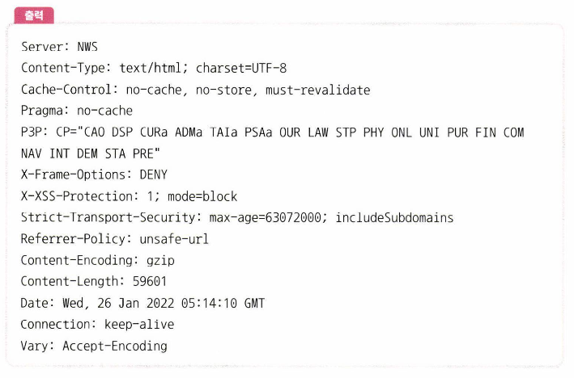

# PDU

네트워크의 어떠한 계층에서 계층으로 데이터가 전달될 때 한 덩어리의 단위

```bash
**curl www.naver.com**
```



- **Header, payload**로 구성되며, 계층마다 부르는 명칭이 다름
    - **Header**: 제어 관련 정보들
    - **Payload**: 데이터

- **계층별 명칭 및 역할**
    1. 애플리케이션 계층 (Application Layer) **메시지** 구조
        - 애플리케이션 계층 프로토콜(HTTP, FTP, SMTP 등)에 따라 패킷 구조가 다름
        - 일반적으로 애플리케이션 계층 패킷은 해당 프로토콜의 헤더와 페이로드(데이터)로 구성
    2. **전송 계층 (Transport Layer)**
        - TCP (Transmission Control Protocol) **세그먼트** 구조
            - Source Port (2 bytes) | Destination Port (2 bytes) | Sequence Number (4 bytes) | Acknowledgment Number (4 bytes) | Header Length (4 bits) | Reserved (3 bits) | Flags (9 bits) | Window Size (2 bytes) | Checksum (2 bytes) | Urgent Pointer (2 bytes) | Options (variable) | Data (variable)
        - UDP (User Datagram Protocol) **데이터그램** 구조
            - Source Port (2 bytes) | Destination Port (2 bytes) | Length (2 bytes) | Checksum (2 bytes) | Data (variable)
    3. **인터넷 계층 (Internet Layer)**
        - IP (Internet Protocol) **패킷** 구조
            - Version (4 bits) | IHL (4 bits) | DSCP (6 bits) | ECN (2 bits) | Total Length (2 bytes) | Identification (2 bytes) | Flags (3 bits) | Fragment Offset (13 bits) | Time to Live (1 byte) | Protocol (1 byte) | Header Checksum (2 bytes) | Source IP Address (4 bytes) | Destination IP Address (4 bytes) | Options (variable) | Data (variable)
    4. **데이터 링크 계층 (Data Link Layer)**
        - 이더넷 **프레임** 구조
            - Preamble (8 bytes) | Destination MAC Address (6 bytes) | Source MAC Address (6 bytes) | EtherType/Length (2 bytes) | VLAN Tag (optional, 4 bytes) | Payload (variable, 46-1500 bytes) | Frame Check Sequence (4 bytes)

- 계층 내 PDU 정의
1. Source Port (2 bytes):
    - 출발지 포트 번호
    - 응용 프로그램이 데이터를 보내는 포트를 식별
2. Destination Port (2 bytes):
    - 목적지 포트 번호
    - 데이터를 받을 응용 프로그램의 포트를 식별
3. Sequence Number (4 bytes):
    - 세그먼트의 순서 번호
    - 데이터의 바이트 스트림에서 세그먼트의 위치를 식별
4. Acknowledgment Number (4 bytes):
    - 다음에 수신할 데이터의 순서 번호
    - 이전에 수신한 데이터의 바이트 스트림에서 다음 위치를 식별
5. Header Length (4 bits):
    - TCP 헤더의 길이를 32비트 단위
    - 옵션 필드의 존재 여부와 길이를 파악하는 데 사용
6. Reserved (3 bits):
    - 추후 사용을 위해 예약된 필드
7. Flags (9 bits):
    - 세그먼트의 제어 정보를 나타내는 플래그들
    - SYN, ACK, FIN, RST, PSH, URG 등의 플래그가 포함
8. Window Size (2 bytes):
    - 수신자가 수신할 수 있는 데이터의 크기
    - 흐름 제어에 사용
9. Checksum (2 bytes):
    - 세그먼트의 오류를 검사하기 위한 체크섬 값
    - 세그먼트의 헤더와 데이터를 포함하여 계산됨
10. Urgent Pointer (2 bytes):
    - 긴급 데이터의 위치
    - URG 플래그가 설정된 경우에만 유효
11. Options (variable):
    - TCP 연결에 대한 추가 옵션
    - 옵션의 종류와 길이에 따라 가변적임
12. Data (variable):
    - 실제 전송되는 응용 프로그램의 데이터
    - 세그먼트의 페이로드
    - 최소 46바이트에서 최대 1500바이트까지 가변적으로 할당
13. Preamble (프리앰블): 프레임의 시작을 알리는 필드로, 수신자와 송신자 간의 동기화를 위해 사용
14. Destination Address (목적지 주소): 
    - 수신 측 MAC 주소
15. Source Address (출발지 주소): 
    - 송신 측 MAC 주소
16. Type: 
    - 상위 계층 프로토콜(예: IP)을 식별하는 필드
17. Frame Check Sequence (FCS): 
    - 프레임의 무결성을 검사하기 위한 오류 검출 코드
    - CRC32 알고리즘을 사용하여 계산