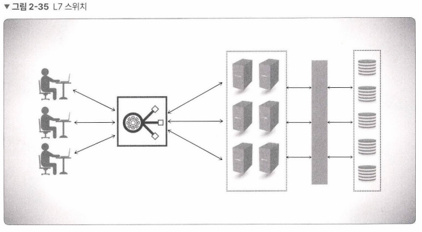

## 2.3.2 애플리케이션 계층을 처리하는 기기

### L7 스위치

- 로드밸런서(LB, Load Balancer): 서버의 부하를 분산하는 기기
    
    ⇒ L7에서 동작하는 로드밸런서는 ‘ADC(Application Delivery Controller)’라고도 부름
    
    
    
- URL, 서버, 캐시, 쿠키들을 기반으로 트래픽 분산
- 바이러스, 불필요한 외부 데이터 등을 걸러내는 필터링 기능 보유
- 응용 프로그램 수준의 트래픽 모니터링
- 로드밸런서에 연결된 서버들에 대해 정기적으로 헬스 체크(Health Check) 수행

- L4 스위치 vs L7 스위치
    
    
    | 구분 | L4 스위치 | L7 스위치 |
    | --- | --- | --- |
    | 계층 | 인터넷 | 애플리케이션 |
    | 분산 기준 | IP, PORT | IP, PORT, URL, HTTP 헤더, 쿠키 등 |
    | 클라우드에서의 활용 컴포넌트 | NLB(Network LB) | ALB(Application LB) |
    
- 헬스 체크
    - 서버의 상태를 파악하기 위해 전송 주기와 재전송 횟수 등을 설정한 이후 반복적으로 서버에 요청을 보내는 것
    - ※ 헬스 체크의 방식
        - Passive Health Checks: 서버에서 수신한 요청에 대해 응답을 제대로 보낼 수 있는지 검사
        - Active Health Checks: 주기적으로 서버에 대한 요청을 보내고 응답을 받아 서버가 정상적으로 작동하는지 여부를 판단
        - Agent-based Health Checks: 서버에 에이전트 설치, 에이전트가 서버 내부의 상태 정보를 수집하여 체크하는 방식
        
        ⇒ 3가지 헬스 체크 방식: [https://another-day.tistory.com/entry/서버를-감시할-수-있는-세-종류의-헬스-체크-방식](https://another-day.tistory.com/entry/%EC%84%9C%EB%B2%84%EB%A5%BC-%EA%B0%90%EC%8B%9C%ED%95%A0-%EC%88%98-%EC%9E%88%EB%8A%94-%EC%84%B8-%EC%A2%85%EB%A5%98%EC%9D%98-%ED%97%AC%EC%8A%A4-%EC%B2%B4%ED%81%AC-%EB%B0%A9%EC%8B%9D) 
        ⇒ spring boot 헬스체크 [https://toss.tech/article/how-to-work-health-check-in-spring-boot-actuator](https://toss.tech/article/how-to-work-health-check-in-spring-boot-actuator)
        
- 로드밸런서를 이용한 서버 이중화
    
    
    
    - 클라이언트는 로드밸런서의 가상 IP에 접근
    - 로드밸런서는 뒷단의 서버에 서빙
