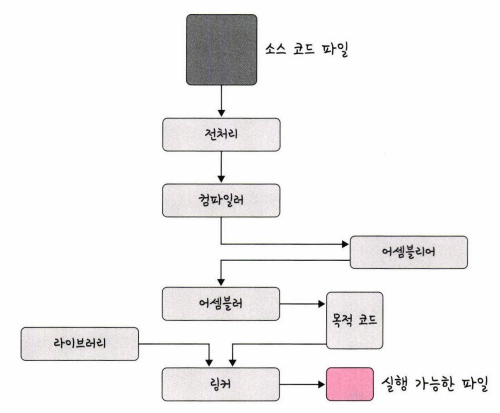

# 프로세스와 스레드
- 프로세스(process)
  - 실행되고 있는 프로그램
  - CPU 스케줄링의 대상이 되는 작업(task)

- 스레드(thread)

## 프로세스와 컴파일 과정
- 프로세스: 프로그램으로부터 인스턴스화된 것
  - ex) 프로그램: chorme.exe / 프로세스: chrome.exe를 2번 클릭하면 chrome 프로세스 시작

- 프로그램: 컴파일러가 컴파일 과정을 거쳐 컴퓨터가 이해할 수 있는 기계어로 번역되어 실행할 수 있는 파일이 되는 것  
  

  - 전처리: 소스 코드의 주석을 제거하고 #include 등 헤더 파일을 병합하여 매크로를 치환
  - 컴파일러: 오류 처리, 코드 최적화 작업을 하며 어셈블리어로 변환
  - 어셈블러: 어셈블리어는 목적 코드(object)로 변환(윈도우: .obj / 리눅스: .o)
  - 링커: 프로그램 내에 있는 라이브러리 함수 또는 다른 파일들과 목적 코드를 결합하여 실행파일 생성 (윈도우: .exe / 리눅스: .out)

## 정적 라이브러리와 동적 라이브러리
- 정적 라이브러리: 프로그램 빌드 시 라이브러리가 제공하는 모든 코드를 실행 파일에 넣는 방식
  - 시스템 환경 등 외부 의존도가 낮고 코드 중복 등 메모리 효율성이 떨어지는 단점

- 동적 라이브러리: 프로그램 실행 시 필요할 때만 DLL이라는 함수 정보를 통해 참조하하는 방식
  - DLL(Dynamic Link Library): 여러 프로그램에서 동시에 사용할 수 있는 코드와 데이터를 포함하는 동적 라이브러리
  - 메모리 효율성에서의 장점과 외부 의존도가 높아진다는 단점

- 차이점
  - 정적: 같은 내용의 라이브러리를 사용할 떄 각각의 프로세스마다 메모리에 라이브러리 내용을 할당
  - 동적: 한 내용만 할당하여 공유해 사용 가능

[참고 자료]
- 라이브러리의 정의와 종류 (https://ledpear.tistory.com/60)
- DLL (https://namu.wiki/w/DLL)