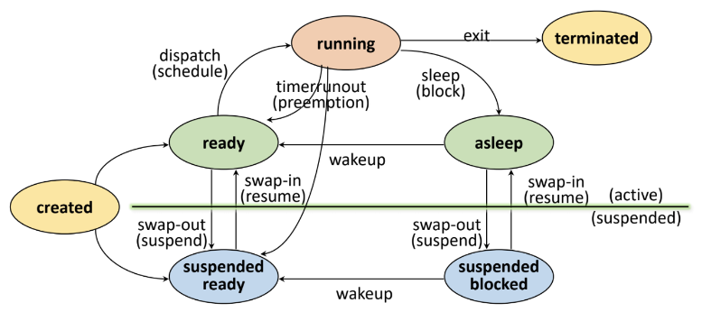
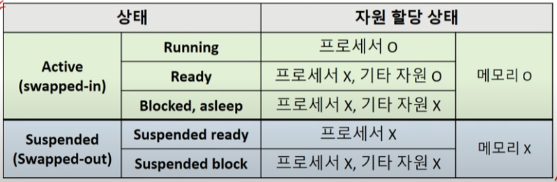

# 프로세스의 상태

- 출처: https://velog.io/@odh0112/OS-Process-states

- created: 프로세스가 생성된 상태. fork() 또는 exec() 함수를 통해 생성. PCB 할당
  - fork(): 부모 프로세스의 주소 '공간'만 복사 및 새로운 자식 프로세스 생성
  - exec(): 새롭게 프로세스를 생성하는 함수

- ready: 메모리 공간이 충분해서 메모리를 할당받음. 그리고 프로세서 할당 대기
- running: 프로세서와 필요한 자원을 모두 할당 받은 상태 (CPU burst)
- running -> ready (preemption): time-out 또는 priority changes로 인해 프로세서를 빼앗긴 상태
- running -> asleep (sleep/block): I/O 등 자원 할당 요청
- blocked/asleep: 프로세서 외에 다른 자원을 기다리는 상태
- asleep -> ready (wakeup): 자원을 할당 받아 다시 프로세서 할당 대기
- suspended: 메모리를 할당 받지 못한(빼앗긴) 상태. Memory image를 swap device에 보관
  - Swap device: 프로그램 정보 저장을 위한 특별한 파일 시스템
- terminated / Zombie: 프로세스 수행이 끝난 상태
  - 모든 자원 반납 후, 커널 내에 일부 PCB 정보만 남아 있는 상태

- 출처: https://www.youtube.com/watch?v=jZuTw2tRT7w