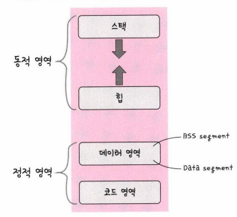

# 프로세스의 메모리 구조

- 스택
  - 지역변수, 매개변수, 함수를 저장하며 컴파일 시에 크기 결정. '동적'인 특성
  - 힙과 스택 영역은 겹치면 안되기 때문에 힙과 스택 사이의 공간을 비워둠

- 힙
  - 동적 할당 시 사용되며 런타임 시 크기 결정. '동적'인 특성

- 데이터 영역
  - 전역변수, 정적변수 저장하며, 프로그램이 종료되면 사라지는 변수가 들어있는 영역. '정적'인 특성
  - BSS segment: 초기화가 되지 않은 변수가 0으로 초기화 되어 저장
  - Data segment: 0이 아닌 다른 값으로 할당된 변수들이 저장

- 코드 영역
  - 프로그램에 내장되어 있는 소스코드가 들어가는 영역.
  - 수정 불가능한 기계어로 저장. '정적'인 영역