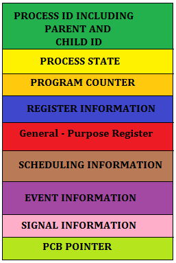
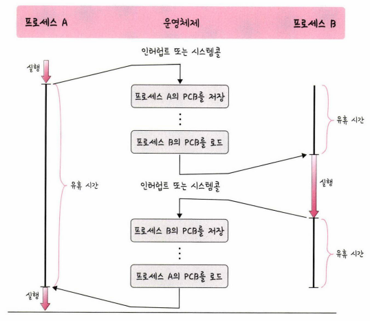

# PCB
- PCB(Process Control Block): 운영체제에서 프로세스에 대한 메타데이터를 저장한 '데이터'
- 메타데이터(meta data)
  - 데이터에 관한 구조화된 데이터이자 데이터를 설명하는 작은 데이터
  - 대량의 정보 가운데에서 찾고 있는 정보를 효율적으로 찾아내기 위해 일정한 규칙에 따라 콘텐츠에 부여되는 데이터

## PCB의 구조

- Process ID: 프로세스를 구분하는 ID
- Process state: 각 State 들의 상태를 저장
- Program Counter: 다음 Instruction의 주소 저장
  - Instruction: 프로그램 상에서의 최소 실행 단위
- Register: Accumulator, CPU Register, General Register 등을 포함한다.
- CPU Scheduling Information: 우선순위, 최종 실행시간, CPU 점유시간 등이 포함된다.
- Memory Information: 해당 프로세스 주소공간(lower bound ~ upper bound) 정보를 저장
- Process Information: 페이지 테이블, 스케줄링 큐 포인터, 소유자, 부모 등
- Device I/O Status: 프로세스에 할당된 입출력 장치 목록, 열린 목록등
- Pointer: 부모/자식 프로세스에 대한 포인터, 자원에 대한 포인터 등
- Open File List: 프로세스를 위해 열려있는 파일의 리스트
  
## 컨텍스트 스위칭

- context: 프로세스가 현재 어떤 상태에서 수행되고 있는지 정확히 규명하기 위해 필요한 정보
- context switching
  - PCB를 교환하는 과정
  - 한 프로세스에 할당된 시간이 끝나거나 인터럽트에 의해 발생

- 비용
  - idle time: context switching으로 인해 프로세스가 중단되고 있는 시간
  - cache miss: context switching이 발생할 때, 프로세스가 가지고 있는 메모리 주소가 그대로 있으면 잘못된 주소 변환이 생김 -> 캐시클리어 하는 과정을 겪기 때문에 캐시미스 발생

  ※ 스레드에서도 context switching이 발생함. 스레드는 스택 영역을 제외한 모든 메로리를 공유하기 때문에 비용이 적고 시간도 적게 걸림.

[참고 자료]
- PCB (https://jettstream.tistory.com/149)
- instruction (http://www.ktword.co.kr/test/view/view.php?nav=2&no=6022&sh=instruction)
- statement (http://www.ktword.co.kr/test/view/view.php?m_temp1=5948&id=1395) 
- context (https://zangzangs.tistory.com/108)