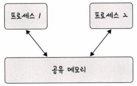
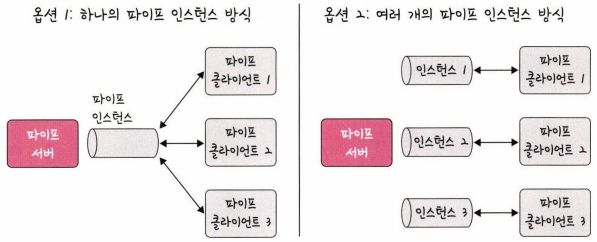
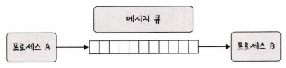

# 멀티프로세싱
## 멀티프로세싱(Multi Processing)
- 여러 개의 프로세스를 통해 동시에 두 가지 이상의 일을 수행할 수 있는 것
- 각 프로세스들이 독립적으로 동작하며 자원이 서로 다르게 할당됨. 여러 개의 자식 프로세스 중 하나에 문제가 발생해도 다른 프로세스들에 영향이 확산되지 않음

  
- 브라우저 프로세스: 주소 표시줄, 북마크 막대, 뒤로 가기 버튼, 앞으로 가기 버튼 등을 담당하며 네트워크 요청이나 파일 접근 같은 권한 담당
- 렌더러 프로세스: 웹 사이트가 '보이는' 부분의 모든 것 제어
- 플러그인 프로세스: 웹 사이트에서 사용하는 플러그인 제어
- GPU 프로세스: GPU를 이용해서 화면을 그리는 부분

## IPC
- IPC(Inter Process Communication)
  - 프로세스끼리 데이터를 주고받고 공유 데이터를 관리하는 메커니즘
  - 종류: 공유 메모리, 파일, 소켓, 익명 파이프, 명명 파이프, 메시지 큐   
  => 메모리가 완전히 공유되는 스레드보다는 속도가 떨어짐

- 공유 메모리(shared memory)
  - 여러 프로세스에 동일한 메모리 블록에 대한 접근 권한이 부여되어 프로세스가 서로 통신할 수 있도록 공유 버퍼를 생성

    

  - 어떠한 매개체를 통해 데이터를 주고받는 것이 아닌 메모리 자체를 공유   
    => 데이터 복사의 오버헤드가 발생하지 않아 가장 빠르고 같은 메모리 영역을 여러 프로세스가 공유하기 때문에 동기화 필요

- 파일(file)
  - 저장된 디스크에 저장된 데이터 또는 파일 서버에서 제공한 데이터를 기반으로 프로세스 간 통신

- 소켓(socket)
  - '동일한 컴퓨터의 다른 프로세스'나 '네트워크의 다른 컴퓨터'로 네트워크 인터페이스를 통해 전송하는 데이터
  - TCP, UDP

- 익명 파이프(anonymous pipe)
  - 프로세스 간에 FIFO 방식으로 읽히는 임시 공간인 파이를 기반으로 데이터를 주고 받음
  - 단방향 방식의 읽기/쓰기 전용 파이프를 만들어서 작동
  - 부모, 자식 프로세스 간에만 사용. 다른 네트워크상에서는 사용 불가

    

- 명명된 파이프(named pipe)
  - 파이프 서버와 하나 이상의 파이프 클라이언트 간의 통신을 위한 명명된 단방향 또는 이중 파이프
  - 클라이언트/서버 통신을 위한 별도의 파이프를 제공하며, 여러 파이프를 동시에 사용 가능
  - 컴퓨터의 프로세스끼리 또는 다른 네트워크상의 컴퓨터와도 통신 가능
  

- 메시지 큐(message queue)
  - 메시지를 큐 데이터 구조 형태로 관리
  - 커널에서 전역적으로 관리되며 다른 IPC 방식에 비해서 사용 방법이 매우 직관적이고 간단
  - 다른 코드의 수정 없이 단지 몇 줄의 코드를 추가시켜 간단하게 메시지 큐에 접근가능
  - 공유 메모리를 통해 IPC를 구현할 때 쓰기 및 읽기 빈도가 높으면 동기화 때문에 기능을 구현하는 것이 매우 복잡 => 이때 대안으로 메시지 큐를 사용
  