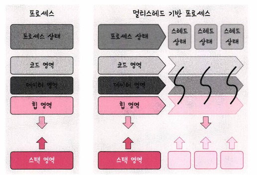

# 스레드와 멀티스레딩

## 스레드
프로세스의 실행 가능한 가장 작은 단위, 프로세스는 여러 스레드를 가질 수 있다.  
즉 프로세스의 실행 흐름을 의미한다.  

  

스레드는 한 프로세스 내에서 코드, 데이터, 힙은 스레드 끼리 공유한다.  

## 멀티 스레딩
- 프로세스 내 작업을 여러개의 스레드를 생성하여 처리하는 방법  

### 동시성
서로 독립적인 작업들을 작은 단위로 나누고 동시에 실행되는 것처럼 보여주는 것 (단일 CPU에서의 작업 처리)

### 병렬성
병렬성은 여러 CPU나 코어를 활용하여 병렬처리  