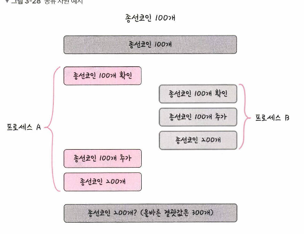
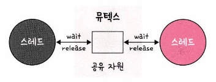
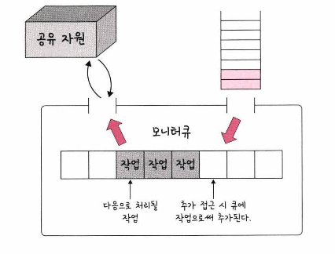

# 공유자원과 임계영역

## 공유자원
- 스레드는 프로세스내에서 실행되는 하나의 흐름이고, 프로세스의 메모리를 공유한다고 했다.  
- 따라서 공유자원은 변수, 파일, 데이터 등을 의미한다.  
- 이 공유 자원을 두 개 이상의 스레드가 동시에 읽거나 쓰는 상황을 경쟁 상태 (race condition)이라고 한다.  

  

두 스레드(또는 프로세스)가 공유 자원에 접근해서 리소스를 조작한다고 할 때  
타이밍이 꼬여 정상적인 결과값을 300인데 실제 값은 200으로 출력되는 것이다.  
이를 잘 처리하는것을 동기화 라고 한다.  
동기화 해야하는 영역을 임계 영역이라고 한다.  

이게 이렇게 되는 이유를 한번 설명해보도록 하겠다.  
공유자원 a의 값 1을 증가시키는 시나리오로 설명하겠다.  
a = 1
- thread 1, thread 2가 있음  
- thread 1은 메모리에서 a 를 읽어온다 이때 a 값은 1
- thread 2도 메모리에서 a를 읽어온다 이때 a 값은 1
- thread 1은 a += 1을 하고 다시 저장한다. 이때 저장된 a 값은 2
- thread 2도 a += 1을 하지만 읽어온 시점에 a값은 1이므로 a 값은 그대로 2로 저장된다.  
따라서 공유 자원에 대해 동기화를 하지 않으면 실제 결과값이 달라지게 되는 것이다.  

## 임계 영역 (critical section)  
두 개 이상의 스레드(또는 프로세스가) 공유 자원에 접근할 때 순서등의 이유로 결과가 달라지는 영역을 임계 영역 이라고 한다.  
임계 영역을 해결하기 위한 방법은 Mutex, Semaphore, Monitor 세 가지가 있다.  
이 3가지 방법의 기반은 Lock이다.  

### Mutex
  
뮤텍스는 공유 자원을 사용하기 전에 설정하고 사용한 후에 해제하는 잠금이다.  
잠금이 설정되면 다른 스레드는 잠긴 코드 영역에 접근할 수 없고, 잠금이 해제된 이후에 접근이 가능하다.  

### Semaphore
세마포어는 간단한 정수 값과 두가지 함수 wait(P), signal(V)로 공유 자원에 대한 접근을 처리한다.  
wait()는 자신의 차례가 올 떄 까지 기다리는 함수이고 signal()은 다음 프로세스로 순서를 넘겨주는 함수이다.  
말로는 어려우니 수도 코드로 작성해 보겠다.  

```kotlin
s = 1

fun P(s: Int) {
  while (s == 0) {
    // busy wait
  }
}

fun V(s: Int) {
  s += 1
}

sharedVal = 10

P(s - 1)
// Critical Section Start
sharedVal += 1
// Critical Section End
V(s)

```

### 모니터
모니터는 둘 이상의 스레드나 프로세스가 공유 자원에 안전하게 접근할 수 있도록 공유 자원을 숨기고 해당 접근에 대한 인터페이스만 제공한다.  
핵심 메커니즘은 모니터 큐를 이용해 공유자원에 대한 작업을 순차적으로 처리한다.  
  
