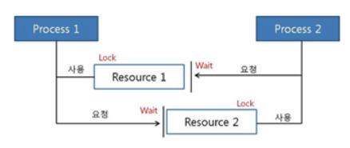

# 교착상태

교착 상태는 두 개 이상의 스레드(또는 프로세스)들이 서로가 가진 자원을 기다리며 중단된 상태를 말한다.  

  

프로세스1, 2가 자원 1, 2를 얻엉야 한다고 가정  
p1: 프로세스 1이 자원1을 얻옴/ 프로세스2가 자원2를 얻음  
p2: 프로세스1은 자원2를 기다림 / 프로세스2는 자원1을 기다림  

## 발생조건
- 상호배제: 자원은 한번에 한 프로세스만 사용할 수 있음
- 점유대기: 최소한 하나의 자원을 점유하고 있으면서 다른 프로세스에 할당되어 사용하고 있는 자원을 추가로 점유하기 위해 대기하는 프로세스가 존재해야 함  
- 비선점: 다른 프로세스에 할당된 자원은 사용이 끝날 때 까지 강제로 빼앗을 수 없음  
- 순환대기: 프로세스의 집합에서 순환 형태로 자원을 대기하고 있어야 함  

## 해결방법
- 자원을 할당할 떄 애초에 조건이 성립되지 않도록 설계한다.  
- 교착 상태 가능성이 없을 때만 자원이 할당되며, 프로세스당 요청할 자원들의 최대치를 통해 자원 할당 가능 여부를 파악하는 은행원 알고리즘을 사용한다.  
- 교착 상태가 발생하면 사이클이 있는지 찾아보고 이에 관련된 프로세스를 한 개씩 지운다.  
- 그냥 다 끄고 다시 킨다.(실제 운영체제가 채택한 방법)  

### 은행원 알고리즘
- 총 할당한 양과 현재 할당한 자원의 양을 기준으로 안정 또는 불안정 상태로 나누고 안정 상태로 가도록 자원을 할당하는 알고리즘  
- 안전 상태: 교착상태 일어날 가능성 없음, 프로세스가 요구한 양만큼 자원 할당 가능
- 불안정 상태: 교착상태 일어날 가능성 있음, 프로세스가 요구한 양만큼 자원 할당 불가능  
