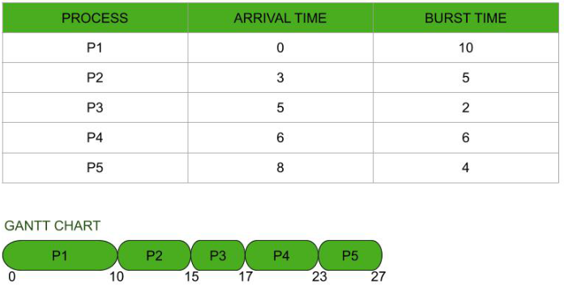
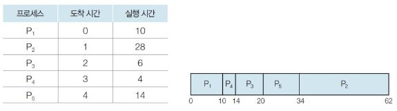
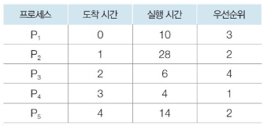
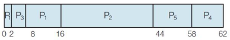
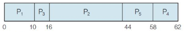

# 비선점형 방식(non-preemptive)
- 프로세스가 스스로 CPU 소유권을 포기하는 방식
- 강제로 프로세스를 중지하지 않음
- 컨텍스트 스위칭으로 인한 부하가 적음

## FCFS(First Come First Service)
- 가장 먼저 온 것을 가장 먼저 처리
- 길게 수행되는 프로세스가 존재하면 convoy effect 발생
- convoy effect: ready queue에서 오래 기다리는 현상

## SJF(Shortest Job First)
- 실행 시간이 가장 짧은 프로세스를 가장 먼저 실행
- starvation: 긴 시간을 가진 프로세스가 실행되지 않는 현상
- 평균 대기 시간 짧음
- 실제로는 실행시간을 알 수 없기 때문에 과거의 실행했던 시간을 토대로 추측해서 사용

## 우선순위(Priority)
- ready queue에 프로세스가 도착하면, '도착한 프로세스의 우선순위'와 '현재 실행 중인 프로세스의 우선순위'를 비교하여 우선순위가 가장 높은 프로세스에 프로세서를 할당
- 우선순위가 동일한 프로세스가 ready queue로 들어오면 도착한 순서대로(FIFO) 스케줄링
- 우선순위 결정법(내부적, 외부적)
  - 내부적 우선순위 결정법
    - 제한 시간, 기억장소 요청량, 사용 파일 수, 평균 프로세서 버스트에 대한 평균 입출력 버스트의 비율
  - 외부적 우선순위 결정
    - 프로세스의 중요성, 사용료를 많이 낸 사용자, 작업을 지원하는 부서, 정책적 요인
- 우선순위가 낮은 프로세서는 실행되지 않을 수 있기 때문에 이를 aging기법을 통해 처리
    
  ※ 우선순위가 높은(숫자가 더 큰) 프로세스 먼저 실행  

  선점    
    
  비선점    
      

[참고 자료]
- FCFS: https://www.geeksforgeeks.org/relation-in-fcfs-and-round-robin-scheduling-algorithm/
- SJF: https://wonit.tistory.com/104
- Priority: https://wonit.tistory.com/108