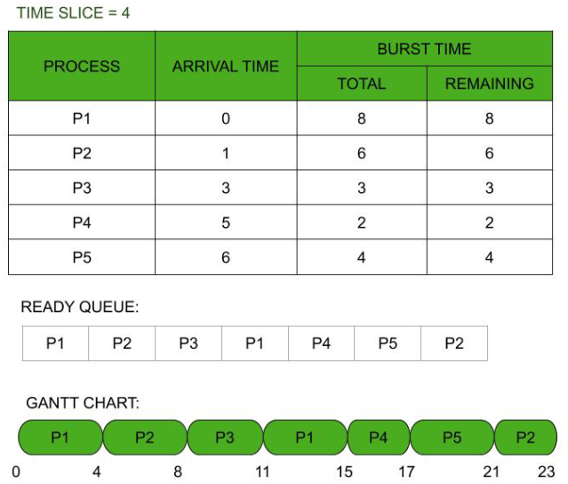
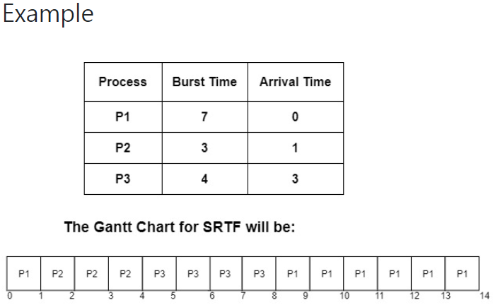
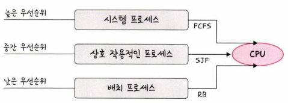

# 선점형 방식(preemptive)
- 지금 사용하고 있는 프로세스를 알고리즘에 의해 중단하고, 강제로 다른 프로세스에 CPU 소유권 할당

## RR(Round Robin)
- 각 프로세스는 동일한 할당 시간을 주고 그 시간 안에 끝나지 않으면 다시 ready queue의 뒤로 들어감
- Time quantum(δ): 각 프로세스에 할당할 시간
- 예를 들어, q만큼의 할당 시간이 부여되었고 N개의 프로세스가 운영된다고 하면 (N-1) * q 시간이 지나야 자기 차례가 됨
- 할당 시간이 너무 크면 FCFS에 가까워지고, 너무 짧으면 컨텍스트 스위칭이 잦아져서 오버헤드가 커짐
- 로드밸런서에서 트래픽 분산 알고리즘으로도 사용

## SRF(Shortest Remaining time First)
- 중간에 더 짧은 프로세스가 들어오면 수행하던 프로세스를 중지하고 해당 프로세스 수행
- SJF와 유사하지만 SJF는 비선점형, SRF는 선점형

## Multi-Level Queue
- 우선순위에 따른 ready queue를 여러개 사용
- queue마다 라운드 로빈이나 FCFS 등 다른 스케줄링 알고리즘 적용
- 기존 수행 중이었던 프로세스가 있는 큐보다 높은 단계의 큐에 새로운 프로세스가 하나라도 있다면 바로 그 프로세스에 프로세서 할당
- queue 간의 프로세스 이동 안됨  

## Multi-Level Feedback Queue
- MLQ에서 queue 간의 이동을 허용한 방식
- 프로세스가 처음으로 시스템에 진입 시 최상위 큐에 삽입
- 만약 실행 중인 프로세스가 모든 time quantum을 소진하여 CPU 시간을 너무 많이 사용하면 '한 단계씩 밑으로 내려보내, 하위 큐의 뒤로 삽입'
- 만약 하위 큐에 있는 프로세스가 time quantum을 다 소진하지 않고 대기 상태로 돌아가면서 CPU를 반납한다면 '상위 큐에 삽입하여 위로 거슬러 올라가도록 함'
- 하위 큐로 갈수록 CPU-bound 프로세스이며, 가장 하위 큐는 FCFS로 스케줄링
- 낮은 우선순위의 큐에서 너무 오래 대기하는 프로세스는 starvation이 발생할 수 있어서, 낮은 우선순위 큐의 프로세스를 높은 우선순위의 큐로 이동시키는 aging 기법을 통해 해결
- 고려해야할 요소들
  - 큐의 개수
  - 각 큐를 위한 스케줄링 알고리즘
  - 한 프로세스를 높은 우선순위 큐로 올려주는 시기를 결정하는 방법
  - 한 프로세스를 낮은 우선순위 큐로 강등시키는 시기를 결정하는 방법
  - 프로세스가 서비스를 필요로 할 때 프로세스가 들어갈 큐를 결정하는 방법

[참고 자료]
- RR: https://www.geeksforgeeks.org/relation-in-fcfs-and-round-robin-scheduling-algorithm/
- SRF: https://www.studytonight.com/operating-system/shortest-remaining-time-first-scheduling-algorithm
- MLQ: https://eunajung01.tistory.com/63
